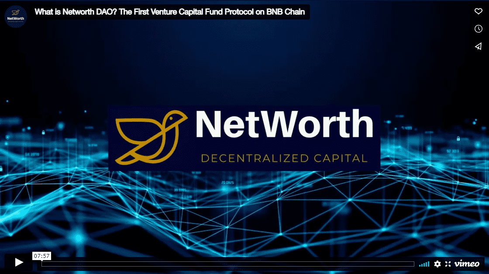
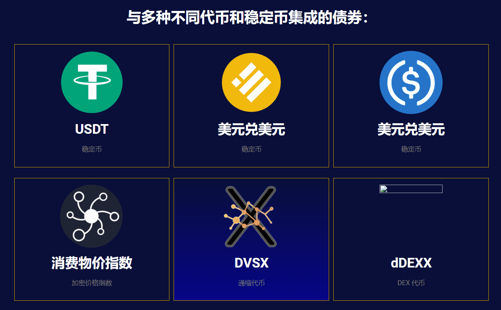

# NetWorth DAO

NetWorth (NETW) 是币安智能链上的风险投资基金协议，具有通胀适应性，保持最低无风险价值 (RFV)，并由社区投票选择的资产和投资策略提供支持。 

简单来说，NETW 是一种由国债资产支持的算法货币，它保持浮动的市场驱动价格。

类似于风险投资基金，国库资产被投资到由社区决定和投票的协议和项目中。NetWorth 也有质押和绑定机制：质押 NETW 代币可以获得更多的 NETW 代币（由国库收益产生），绑定 NETW 代币允许用户以折扣价购买新的 NETW 代币（确保 NETW 市场的永久流动性）。

NetWorth 有一个出色的解决方案，可以以一种适应甚至利用通货膨胀的方式来维持潜在价值。此外，质押和绑定机制提供了额外的方法来增加您的收入。

NetWorth 的目标是通过在其投资组合中不断添加可靠和稳定的加密资产的混合物，并在新兴市场领域（如 DeFi、NFT、游戏和元界开发）中抓住巨大的新机遇，从而随着时间的推移实现价值增长。

我们的筹款和财务建设阶段基于高度成功的 OlympusDAO 技术，该技术近一年来平均 5 天的投资回报率保持在 8% 以上。然而，我们的项目在几个方面与奥林巴斯不同。奥林巴斯正在尝试建立一种稳定的储备货币，而我们正在尝试建立一个去中心化的自治组织，该组织可以积累资产并随着时间的推移稳定可靠地增加价值。NetWorth 的目标不仅是实现这些资产的增值，而且随着时间的推移积累更多的资产。持有 NETW 将为您提供对冲基金和加密货币投资的最佳组合，所有这些都包含在从第一天开始就由社区管理的流动资产中。

