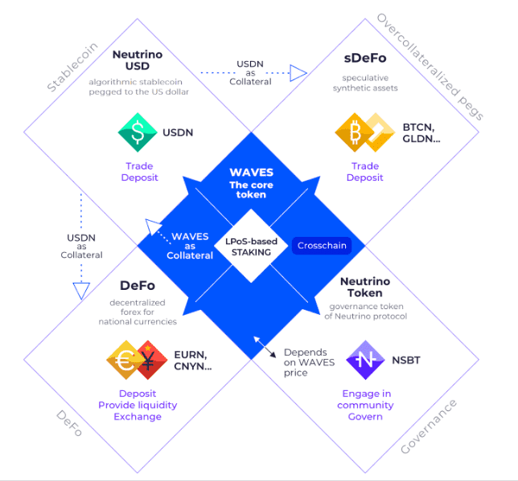

# Neutrino Protocol

协议是一种算法价格稳定的资产化协议，可以创建与现实世界资产或加密货币相关的稳定币。Neutrino 协议由一组用编程语言 Ride编写并部署到Waves区块链的交互智能合约表示。目前，大多数 Neutrino 协议的操作都可以通过Waves.Exchange接口进行。Waves Explorer和社区驱动的服务（如Pywaves或w8io）可以在Waves 区块链中导航。 

Neutrino 系统基本上由 4 个核心代币组成：WAVES、USDN、NSBT 和 SURF。WAVES 是 Waves 区块链的核心代币，用于支付交易费用。它作为主要的 Neutrino 稳定币 USDN 的抵押品。USDN 是一种与美元挂钩的算法稳定币。它作为其他 Neutrino 稳定资产的抵押品。NSBT 是 Neutrino 协议的资本重组和治理代币，可确保 USDN 抵押品储备的稳定性。SURF 是一种衍生代币，旨在改善 USDN 储备的资本重组机制。
Neutrino 稳定资产是数字资产，相当于其底层的现实世界类似物。例如，EURN 以 1 比 1 的比例与欧元挂钩。所有 Neutrino 资产都利用底层 Waves 区块链的共识算法来实现质押，从而刺激用户拥有资产。
去中心化外汇或 DeFo 是建立在 Neutrino 协议之上的扩展，可实现与流行的国家货币、指数或商品相关的稳定价格资产之间的即时交换。第一个 DeFo 接口由Waves.Exchange实现。
除了 Waves 区块链，USDN 和 NSBT 代币也可用于以太坊和币安智能链生态系统。

# 实体

总体而言，在 Neutrino 系统中存在五种类型的链上和链下实体并相互交互，通过智能合约链接在一起：
1 .用户：拥有 Waves 帐户的任何人（通常通过Keeper Wallet和Waves Signer扩展程序进行管理）。
2 .价格预言机：一组预先确定的账户，为区块链提供来自不同来源的市场价格信息。
3 .Pacemaker oracles ：触发交易和处理复杂计算的任何 Waves 帐户（通常是机器人）。由于 Ride 语言的非图灵特性和计算复杂性的限制，系统运行需要起搏器预言机。 
4 .Waves 全节点：点对点区块链网络中的Waves 节点，基于租赁权益证明算法运行。它为 Neutrino dApp 积累和分配区块奖励。自 2022 年起，所有 Neutrino 储备都出租给社区节点。注意：您可以在dev.pywaves.org 找到完整节点的列表。
5 .紧急预言机：由社区选择的账户，在智能合约基础设施遭到恶意黑客攻击时，有权停止协议的运行 并重新激活它。除了这个权限之外，这个参与者在系统内没有任何特殊的访问或控制权。
