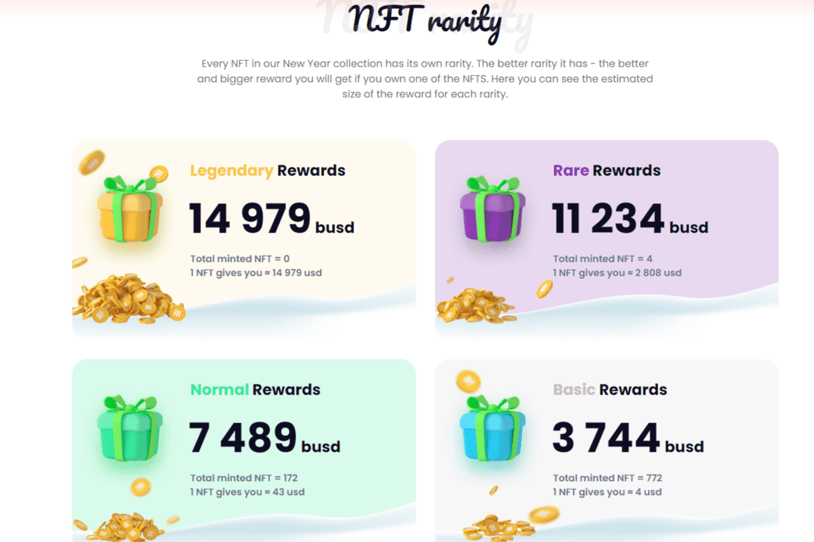
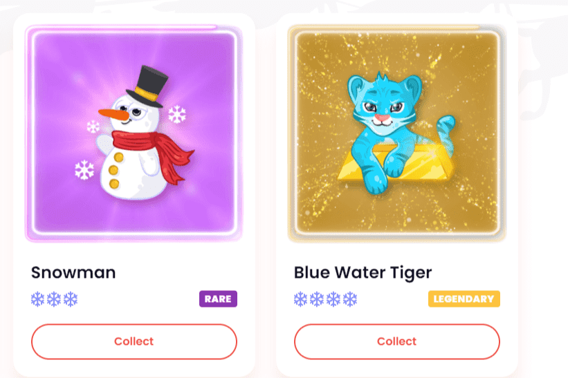

# New Year Token

欢迎来到新年奇迹！新年快乐！

🎄New Year Token — 是您庆祝节日和节日气氛的个人指南！我们的项目主题——新年庆祝活动以及与此相关的一切。🎁 这是您用我们独特的新年魔法盒试试运气的机会！每个 NFT 都是特殊且独特的。共有 10 种不同的 NFT。☃️ 我们有独特的 NFT 并具有实际用途。每个 NFT 都有自己的稀有度——稀有度越高 = 你从 NFT 奖励池中获得的奖励就越好。我们的特点： ❄️ 0% 税 ❄️ 带有 NFT 的魔盒 ❄️ 具有不同稀有度的 NFT ❄️ NFT 奖励池！！❄️新年气氛❄️流动性锁定 

**代币名称：新年代币**

**代币代码：NYT**

**交易税 = 10%，70% = NFT 奖励，30% = 营销。**

**纽约时报合约：**0xfDfF7a8eDA6a3739132867f989bE4bf84E803c15

购买新年币

冬季庆祝活动的一些典型和流行的象征。我们的主要目标是为每个人创造一种新年的感觉，让每个人都有机会和机会感受冬天的魔力！

我们还涵盖了相关主题，例如：圣诞快乐、中国新年，我们只是使用了世界各地冬季庆祝活动的一些典型和流行的象征。我们的主要目标是为每个人创造一种新年的感觉，让每个人都有机会和机会感受冬天的魔力！

我们的代币有 10% 的税。70% 的税收用于 NFT 奖励池，30% 用于营销。实施这项税收是为了防止投机者加入我们的项目，它对我们的 NFT 奖励池有很大帮助，在这种情况下，它会增长得更快。

*我们的项目是独一无二的，你找不到像我们提供的东西……* 

**我们的主要特点：**

- 魔盒
- 新年NFTs
- 碎冰农场
- NFT奖励

