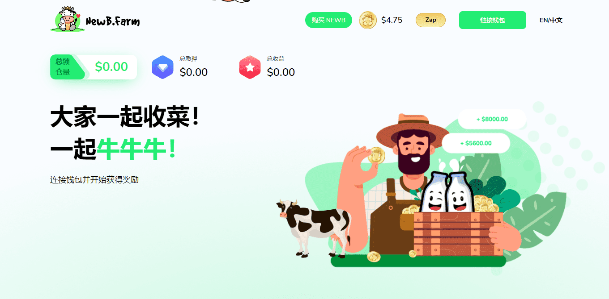

# NewBFarm

这是为加密世界的新手设计的新一代单产农业平台。该平台支持在 BSC（币安智能链）上进行交易，这是最快的区块链之一，可确保最低的交易费用。NewB.Farm 是一个创新概念。用户充当农民，他们会挤奶并赚取鸡蛋（奖励）。

该平台为加密初学者提供了一个相对有趣且引人入胜的界面，可以轻松参与 DeFi。

开启你在 DeFi 世界的旅程，NewB.Farm 可以成为你的完美伴侣！通过这些渠道探索以了解有关 NewB.Farm 的更多信息。

目前，我们拥有来自新加坡、迪拜、马来西亚、日本、韩国、香港、泰国、印尼、中国大陆、俄罗斯等14个社区的24778名活跃持有人！

NewB.Farm是一种基于币安智能链 (BSC) 的创新单产农业协议，BSC 是最快、最具可扩展性的区块链之一，交易费用低。这使 NewB 成为像您这样的新手的理想单产农业平台。

它提供了一个直观、用户友好的生态系统，即使是加密货币初学者也可以轻松参与 DeFi，并在公平、安全和透明的环境中探索惊人的单产农业机会。

这个平台的概念非常有趣，并且与我们的根，农民息息相关。在 NewB Farm，农民将成为不只是挤奶牛的用户，他们挤奶现金牛并收取每日收入而不是鸡蛋。

如果您想开启您在加密世界的旅程，NewB.Farm 是您的完美之旅！它简单、有利可图且易于理解，正是每个农民和他的牲畜都需要的方式。
