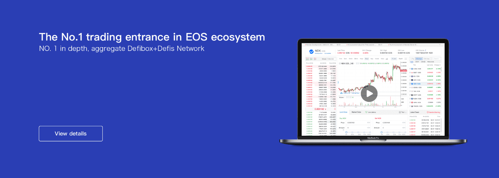
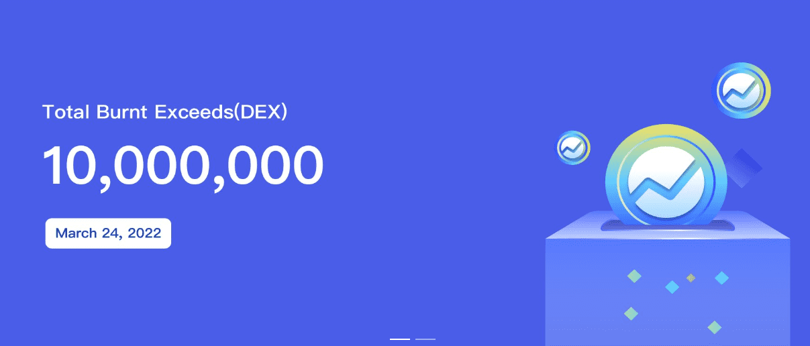

# Newdex

Newdex于2018年8月8日上线EOS，是全网领先的链上撮合结算的订单簿去中心化交易所。Newdex与20多个数字货币钱包（TokenPocket、imToken、Bitpie等）达成合作，完美呈现“智能合约撮合，交易完成收资产”的去中心化交易体验。2021年1月19日，Newdex完成全新升级，从订单簿去中心化交易所升级为聚合去中心化交易所，并成功聚合了Newdex的限价单深度和EOS上各大Swap的流动性池深度（ Defibox、Defis Network 等），让 EOS 用户获得最佳深度和最佳价格的交易体验，成为 EOS 生态的第一个交易入口。

Newdex致力于利用DeFi的可组合性聚合多链DEX的深度，开发“深度最好、价格最优、体验最好”的聚合DEX，为用户提供良好的去中心化交易体验，成为多链DEX 交易入口。

 

**Newdex（BSC）项目特点**

**聚合硬币信息以提高决策效率**

Newdex聚合全网币信息，建立最全面的币信息数据库。用户可以根据币种符号、项目名称、合约地址、所属行业等信息找到币种，进一步提高用户决策效率，降低决策成本。

**聚合掉期深度以增加交易深度**

Newdex聚合多个Swap的流动性池深度，为用户提供深度最优、价格最优的交易体验。同时Newdex展示多个Swap行情数据对比，让交易信息更加透明。

**高级K线，媲美中心化交易所**

Newdex提供先进的K线，满足各类投资者的需求。K线图的主要特点：每张图表包含25个指标，一个布局可以添加8个图表，图表上的参考数据增加4倍等，可媲美中心化交易所的交易体验。

**添加行情，挖掘优质币**

Newdex提供行情列表，包括稳定币交易区、BNB交易区、新币交易区等，用户可以根据“24小时成交量”、“24小时变化”、“24小时”等指标查找热门币搜索量”，他们还可以根据标签过滤他们关心的硬币。

 

**Newdex（EOS）项目特点**

**数据上链，公开透明**

利用区块链技术实现订单信息可上链查询。相关交易数据透明、防篡改、实时可查，避免交易所内部操纵；

**值得信赖，高度安全**

Newdex无权获取用户私钥，用户对自己的资金拥有完全的控制权，避免了资产被盗、资产挪用、资金外逃等风险，有效保护了用户的资产安全；

**便捷交易，实时收款**

交易账户去中心化，无需注册，无需充值，无需提现，交易完成后实时接收资产，为用户提供便捷的操作体验；

**关注流动性，各种活动**

支持各类代币自由流通，及时上币，让用户账户内的代币资产快速变现；组织丰富多彩的活动，丰富用户的生活。
