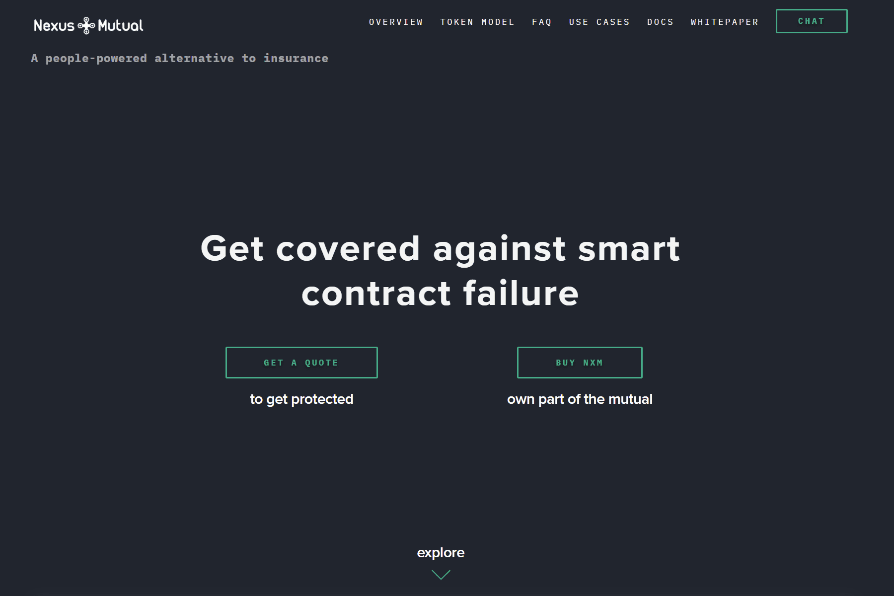
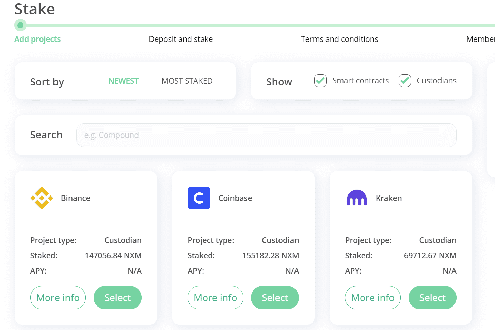

# Nexus Mutual

**基于区块链的解决方案**

Nexus Mutual 使用以太坊的力量，因此人们可以在不需要保险公司的情况下共同分担风险。

**智能合约封面**

保护智能合约代码中的风险和潜在错误。为 DAO hack 或 Parity 多重签名钱包问题等事件提供保障。

**互惠保险取代保险**

我们正在建立一个替代风险分担平台。

未来我们计划提供加密钱包保护套，以及更多标准产品，如地震保护套
