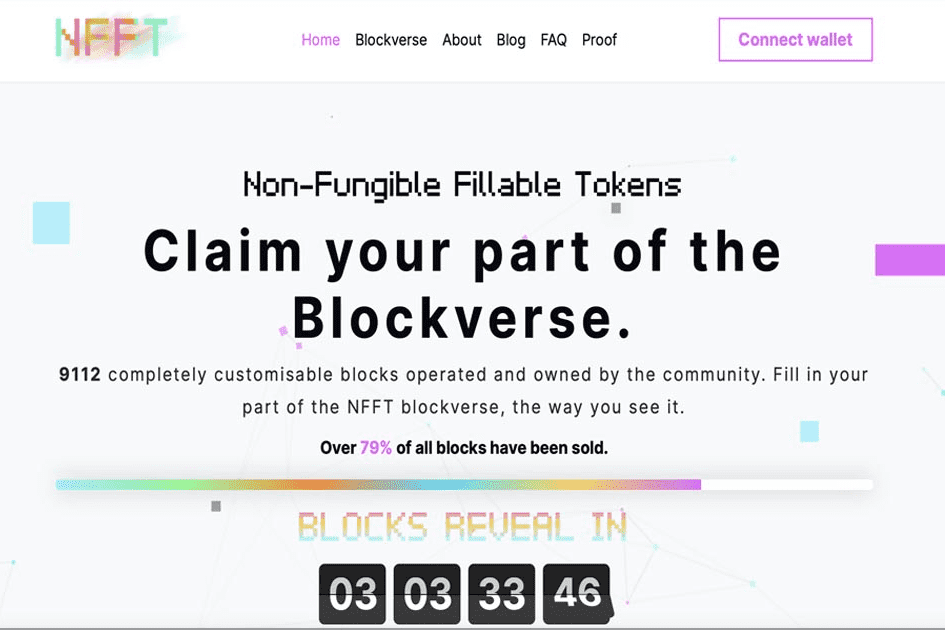

# NFFT Blockverse

一个去中心化的实验，允许任何人管理、拥有和运营他们自己的 9112 - Blockverse 部分。构建、协作和推广，永远存储在以太坊区块链上。

## 什么是 NFFT Blockverse ？

**NFFT.com 101**

如果您是 NFFT 区块链的新手，那么您应该束手无策，因为我们将带您了解成为平台上升到 NFT 行业前沿的推动力的关键点：

- NFFT.com blockverse - 它是与以太坊区块链相连的艺术墙、画廊、在线房地产空间。这是一个观众可以保护自己的街区，扩大所有权足迹并最终将他们的空间变成想到的任何东西的地方。这一切都归功于NFFT**不可替代的可填充代币**和与传统 NFT 市场相比更容易浏览的 blockverse 墙。
- NFFT 代币——除了是我们的骄傲和喜悦之外，它还是传统 NFT 智能合约的下一代，而它的可填充功能成为两者之间的主要区别。这意味着您的代币和不动产可以**不仅仅是一个艺术展示空间**。它可以是最杰出的区块链项目去宣传自己并吸引流量的地方。它可以成为访问公众人物资料的门户，在这里您可以安全地存储、推广和销售您的艺术品或音乐，同时从 NFFT.com 收集的由其他 9111 区块所有者放大的有机流量中获取收益。 

## NFFT.com 的愿景是什么？

作为一个去中心化的社区主导项目，NFFT Blockverse 只受限于社区的创意产出。愿景一直是自治的 Blockverse 社区，而 NFFT 的存在已经实现了这一愿景。

从这里开始发生的事情是开放的、令人兴奋的和未知的。社区将决定 Blockverse 的下一步是什么，参与是开放的，每个人都是受欢迎的贡献者。

## 谁创建了 NFFT？

NFFT 是作为一个 DAO 组织的，由世界各地的志愿者开发者、NFT 爱好者、商业人士、作家和营销人员组成的社区，他们投入了时间、精力和无尽的想象力，将 Blockverse 变为现实。

## NFFT 中可以显示什么？

每个块是一个基本单元，它是一组 15x15 的像素。15x15 像素是 NFFT 的最小单位，称为公共块。

NFFT.com 于 2021 年 4 月 23 日公布了每个区块的位置和稀有度。

实际的区块分配是由区块序列的可证明公平的证明生成的。每个块位置和属性都使用 SHA-256 算法使用以下序列进行散列：“{X}x{Y}|{rarity}”。通过连接此序列中每个块的 SHA-256 获得组合字符串。最终证明是通过 SHA-256 散列这个组合字符串获得的。生成的出处记录存储在智能合约中。证明链接在 NFFT 网站顶部的菜单中。

