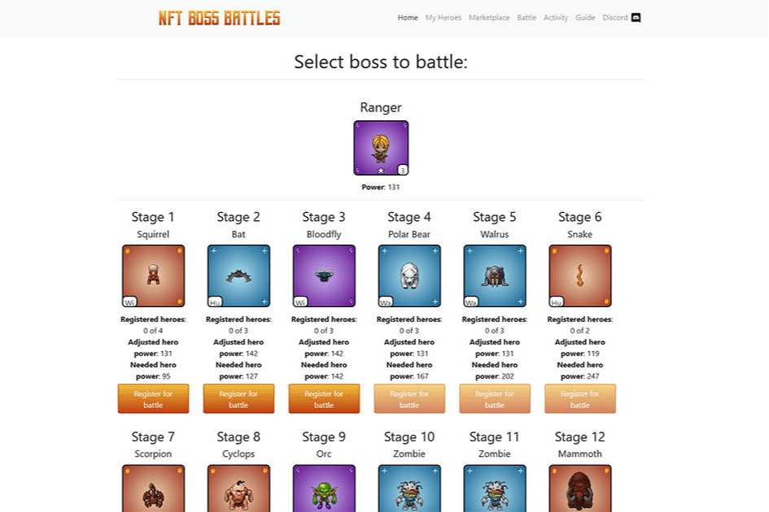
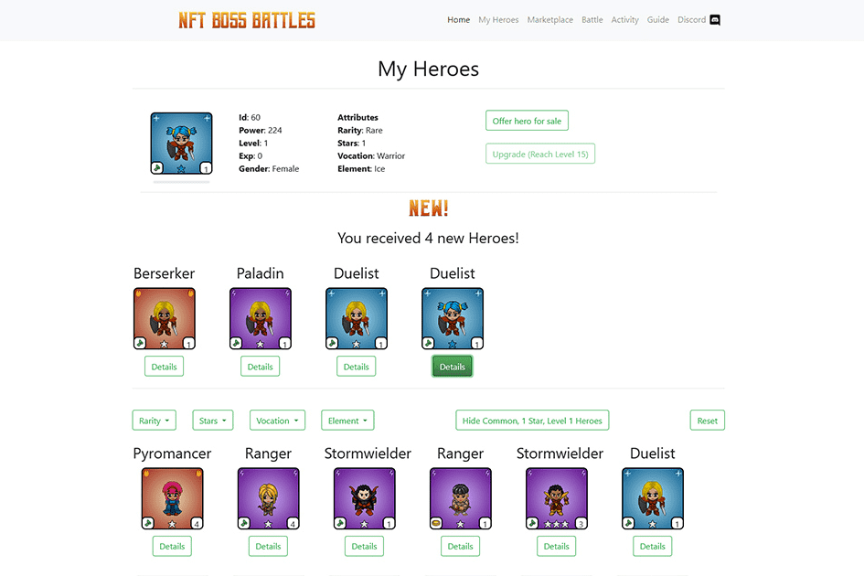

# NFT Boss Battles

**从独特的代币和低成本中获利**

NFT Boss Battles 中的每个英雄都是独一无二的，并作为不可替代的、基于以太坊的 ERC-721 代币实现，玩家可以自由交易。该游戏是运行在币安智能链上的真正去中心化应用程序，可实现快速且廉价的交易。

**享受合作游戏体验**

创造你的英雄并派他们去对抗强大的老板。升级并获得更多具有不同属性的角色，以组建一支势不可挡的小队。与其他玩家联手对付越来越强大的怪物。

**开始玩就像访问网站一样简单**

该游戏可以直接在您的网络浏览器中玩，网址为 www.nft-boss-battles.com。您只需要适用于 Mozilla Firefox 或 Google Chrome 的 MetaMask 扩展程序，就可以加入战斗并获得 NFT。

**受益于数十年的经验**

NFT Boss Battles 是德国开发商 CipSoft 的新原型，它将 20 多年的在线游戏经验带入区块链领域。开创性的 MMORPG Tibia 的制造商已经发布了第一款真正的莱特币游戏 LiteBringer。
