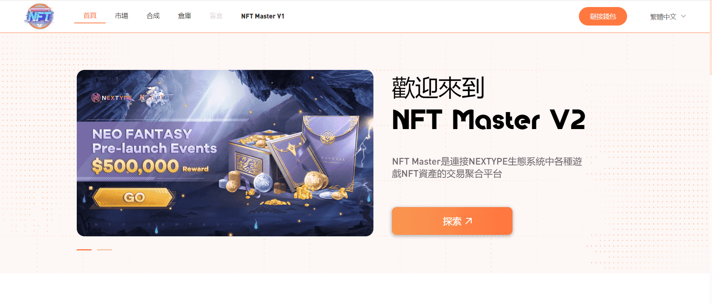

# NFT Master

NFT Master 是一个聚合器，链接 NEXTYPE 生态系统中各种游戏的 NFT 资产。玩家可以在游戏中查看自己持有的 NFT 并与其他玩家自由交易，还可以公开拍卖稀有的 NFT。同时 NEXTYPE 正式发布的 NFT 也将在 Market Place 供玩家购买。未来各种合作项目也可以在NFT大师中开设NFT精品店，让玩家在dapp中完成NFT收藏、交易和兑换体验。

在下个版本中，还将更新NFT铸造和合成玩法，玩家可以使用NT进行NFT合成或铸造，这是一个很棒的新体验，玩家可以创建各种NEXTYPE生态游戏NFT，NFT可以及时出售获得收益，或者可以进入各类GameFi进行深度体验，获取长期收益。

这一切都将以玩家收入为原点，让NFT Master成为NEXTYPE生态中NFT价值捕获的聚合器。

