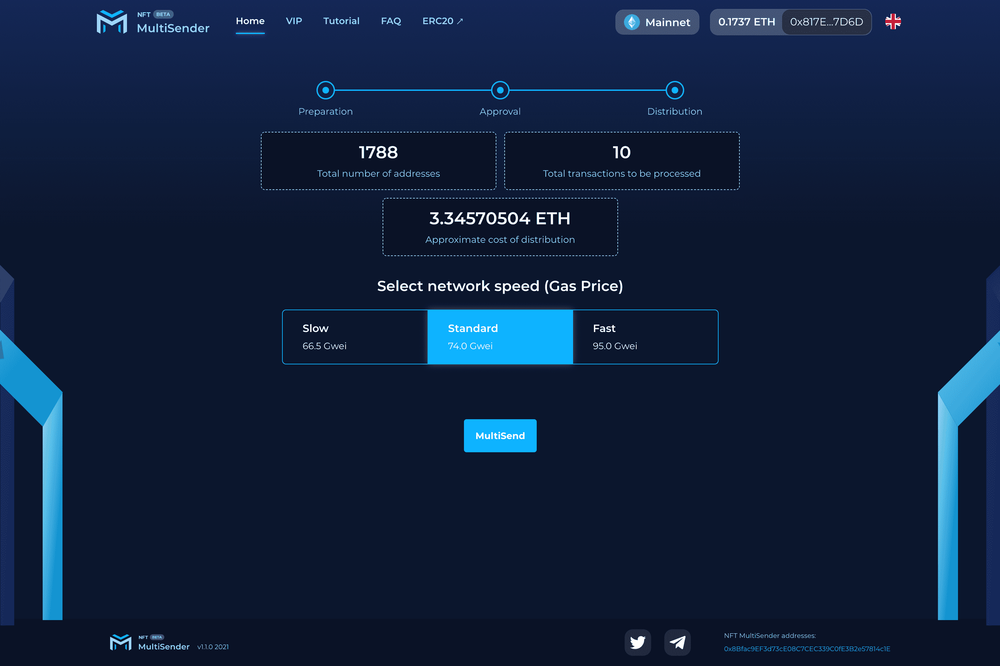

# NFT Multisender

在一次交易中将 ERC721 和 ERC1155(NFT) 代币发送到数千个地址。批量传输erc721 & erc1155。现在支持的网络：BSC & ETH & xDAI & Polygon & IoTex & Arbitrum & Optimism。

该 DApp 允许用户通过批量传输和自动化流程有效地将数千个 NFT 发送到多个地址。该工具使用户能够通过在 MetaMask 上自动生成交易来节省时间。NFT-Multisender 还允许用户通过将其私钥的信任委托给安全的 MetaMask 钱包来维护其帐户的安全。

