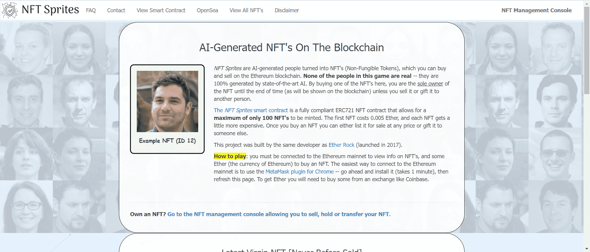

# NFT Sprites

NFT Sprites 是 AI 生成的人变成了 NFT（非同质代币），您可以在以太坊区块链上买卖。这个游戏中没有一个人是真实的——他们是 100% 由最先进的人工智能生成的。通过在此处购买其中一个 NFT，除非您将其出售或赠送给他人，否则您将是 NFT的唯一所有者，直到时间结束（如区块链上所示）。

NFT Sprites智能合约是完全合规的ERC721 NFT 合约，最多只能铸造 100 个 NFT。第一个 NFT 花费 0.005 Ether，每个 NFT 变得更贵一些。购买 NFT 后，您可以以任何价格将其挂牌出售或赠送给其他人。

该项目由与Ether Rock（2017 年推出）相同的开发商建造。

玩法：您必须连接到以太坊主网才能查看 NFT 的信息，以及一些 Ether（以太坊的货币）才能购买 NFT。连接到以太坊主网的最简单方法是使用适用于 Chrome 的 MetaMask 插件——继续安装它（需要 1 分钟），然后刷新此页面。要获得 Ether，您需要从 Coinbase 等交易所购买一些。

