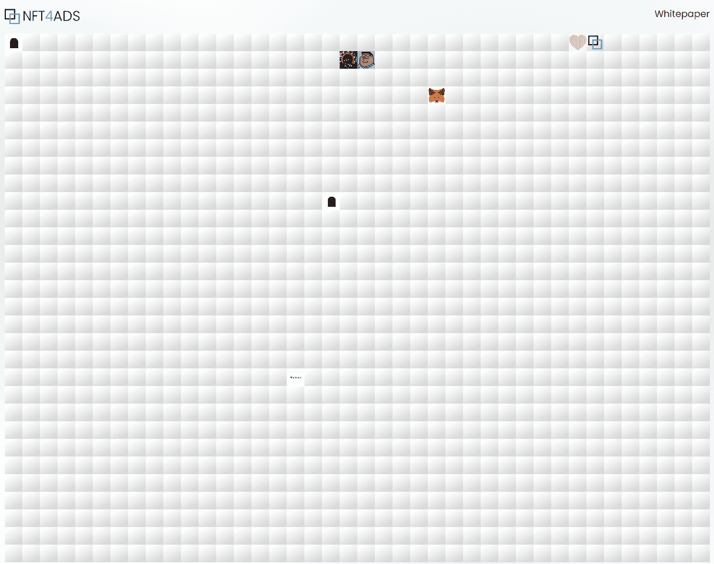

# NFT4ads

NFT4ads 的目标是提供一个场所，以完全去中心化的方式推广您想要的任何东西，例如您自己的 Youtube 频道、商业网站等。我们将不断扩展这个生态系统，以便将感兴趣的第三方带到 NFT4ads 平台。每个试图宣传他们的网站、Youtube 频道、产品或服务的人都知道，找到最佳转换渠道是您一直在寻找的。想象一个地方，您可以购买一个空间来推广您的业务，然后以相同或更高的价格出售该空间。这是一个前所未见的概念：您获得促销服务，然后在您出售空间后收回您的钱。  

我们独特的愿景、代币经济学和快速的病毒式增长将为生态系统带来剩余收益。  

**为什么选择多边形网络** 

在比较不同的区块链时，您会想知道我们为什么选择 Polygon 网络。Polygon 网络的设计方式融合了最人性化的功能之一，并不断吸引新用户加入链。我们的首要任务是确保 NFT4ads 可以在零外部法规影响的情况下自由更改和发展，而 Polygon 是实现这一目标的方式。  

**NFT4ads 的代币经济学** 

NFT4ads nfts 和 AdLords 是从市场的真正需求演变而来的。我们大多数人都在社交网络或搜索引擎上购买了广告，但没有收到预期的效果。是时候停止为没有价值的 ADS 浪费您的时间和金钱，成为 ADLord 了。

NFT4ads 将突出一个旗舰 NFT： AdLord NFT：$Adlord 在 NFT4ads 上，您的 Adlord nfts 将要求具有 30x30 像素块的插槽。最好的 Adlords 将征服 NFT4ads 上的特定土地，并将这些土地出售或出租给其他 AdLords。  
