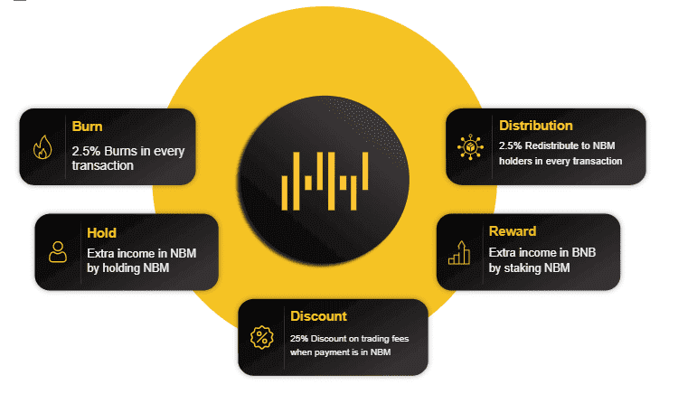

# NFTBlackMarket

用区块链技术赋能创作者。比以往任何时候都更实惠地将任何东西表示为独特的数字资产。平均而言，用户可以节省高达 99% 的汽油费。

##### 多区块链

NFTBlackMarket 是一个多链 NFT 平台。此功能为您提供了无限的可能性以及很大的自由度和可扩展性。我们目前仅支持 Smart Chain，但很快我们还将支持其他区块链，包括 Ethereum、Tron、Cardano、Polygon、Solana、Hashgraph 和 Polkadot。

**桥梁系统**

在桥接系统中，您可以在不同的区块链之间转移您的 NFT Token。例如，您可以将您的 NFT 代币从以太坊转移到 Solona 或从 Cardano 转移到 Polkadot。

##### 桥梁系统如何工作？

当您将 NFT 代币从以太坊转移到 Cardano 时，首先您在 Ethereum 上的 NFT 代币将被烧毁，然后具有先前信息和元数据的新 NFT 代币将在 Cardano 上铸币。

### 资产互联网

创建、收集和交易数字资产。

NFT 是我们可以用来表示独特物品所有权的代币。他们让我们对艺术品、收藏品甚至房地产等事物进行代币化。NFT 代表不可替代的代币。不可替代是一个经济术语，您可以用它来描述您的家具、歌曲文件或计算机等事物。这些东西不能与其他物品互换，因为它们具有独特的属性。
在 NFTBlackMarket 中，您可以对您的艺术、GIF、音乐、视频、专利和文档进行 NFT。
