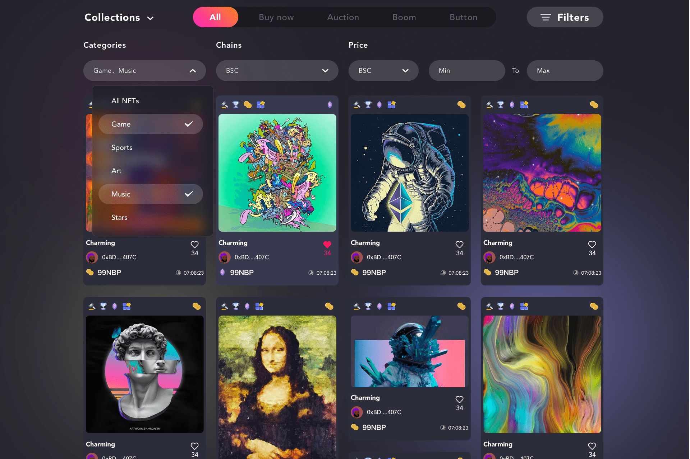

# NFTBomb

NFTBomb 以元界视图的形式体现了底层 NFT 协议的自我修养。其他 NFT 和 gamefi 项目可以基于 NFTBomb 构建无数完全不同的世界观。

除了提供这种所有权协议生态，NFTBomb 还可以提供引用协议生态的新范式。引文协议生态类似于学术文献的引文。换句话说，如果你想做一个研究项目，你需要从零开始研究吗？这是完全没有必要和毫无意义的，因为你只需要站在巨人的肩膀上，避免傻瓜的差事。
