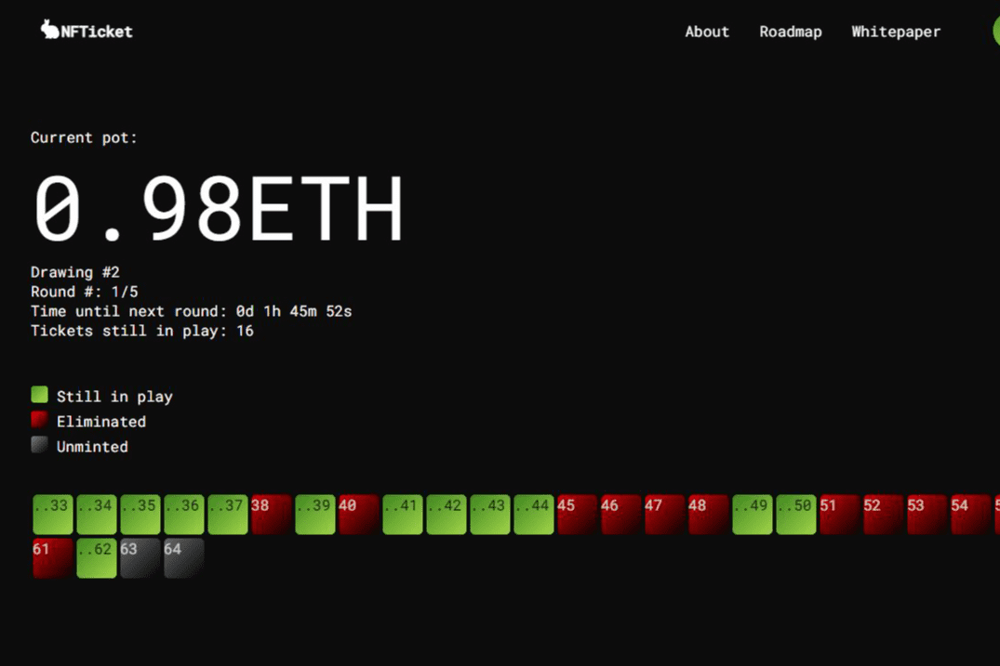

# NFTicket

NFTicket 的使命是通过引入区块链技术提供的透明度和安全性来颠覆传统的彩票系统，同时最大限度地发挥玩家优势。通过使用提供加密安全和可验证随机性的智能合约，NFTicket 确保所有参与者都有平等的获胜机会。

NFTicket 为加密社区实施了多种独特的赚钱方法，而不仅仅是参与 NFTicket 绘图。除了我们的 NFT，NFTicket 还将拥有自己的 ERC20 代币，称为 $KENO。$KENO 持有者在每次 NFTicket 抽奖后都会获得 ETH 奖励，因为我们相信社区应该分享收入，无论是否购买了 NFTicket。$KENO 代币持有者也将有能力质押我们的代币和 LP 代币，在此过程中赚取二级 NFTicket 销售产生的 ETH。

未来，NFTicket 团队计划将这项技术提供给其他有兴趣为自己的社区进行抽奖活动的加密货币项目。这有可能为 NFTicket 和 $KENO 代币的多个新用例增加无限的额外收入途径。

