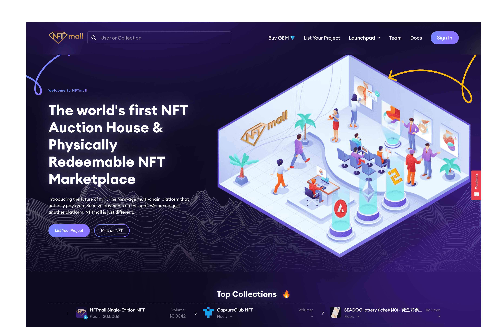

# NFTmall

 NFTmall - 具有 NFT 物化服务的多链 NFT 市场和启动板。

一个强大的多链 NFT 平台，赋予创造力。它让 NFT 创作者在赚钱的同时享受乐趣。NFTmall 不仅仅是一个市场，而是一个由其实用程序和治理令牌 GEM 管理的社区。

我们的使命包括弥合数字化和现实世界之间的差距，同时通过引入 NFT 物化服务等革命性功能来允许 NFT 的现实用例。使用 NFTmall，任何人都可以以简单且经济高效的方式铸造、列出和交易 NFT。得益于其超高效的智能合约。

我们是面向 NFT 创作者、交易者和爱好者的下一代 NFT 市场和 Launchpad。我们的平台正在协同 DeFi 和电子商务，以实现完全自主和版税驱动的市场。

NFTmall = 多链 NFT 基础设施提供商 + 强大的 NFT API + NFT 物化服务 + Launchpad。

