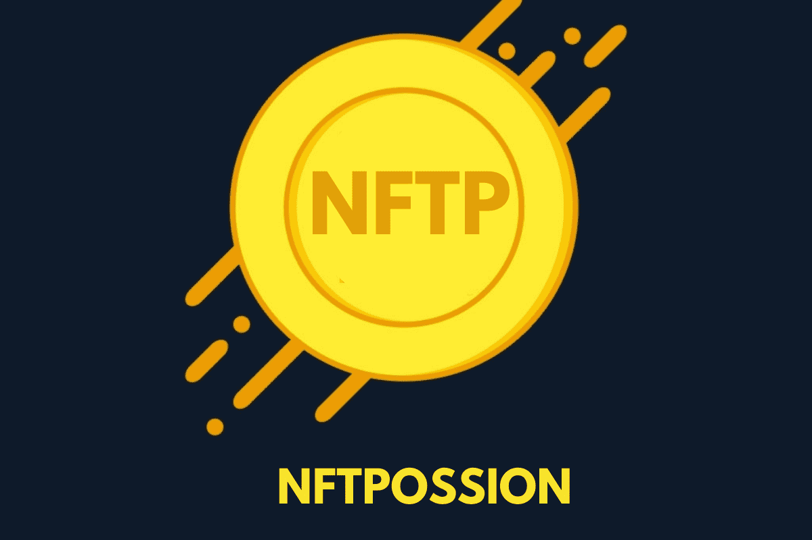

# NFTPOSSION

#Nftpossion (#NFTP) 是一个 NFT 社区驱动的项目，具有#MetaGaming 功能。大约 21% 以上的#NFTPTotal 供应在铸币过程中被烧毁，代币在每笔交易中经常被烧毁 1%。

在每笔交易中都会发生 3 个简单的功能：

=> 3% 重新分配给所有#NFTP 持有者👍，

=> 1% 用于营销❣️和慈善。

=> 每笔交易自然燃烧🔥🔥 1%。

#NFTPOSSION 是 NFT、稀有数字物品和加密收藏品的点对点市场，具有先进的 MetaGaming

特征。#NFTP Tokonomic 对长期玩家非常友好和有益。3％的费用重新分配给所有#NFTP持有人

在每笔交易中。每笔交易都会燃烧 1% 的 NFTP 代币。1% 的费用保留用于营销和慈善事业。

