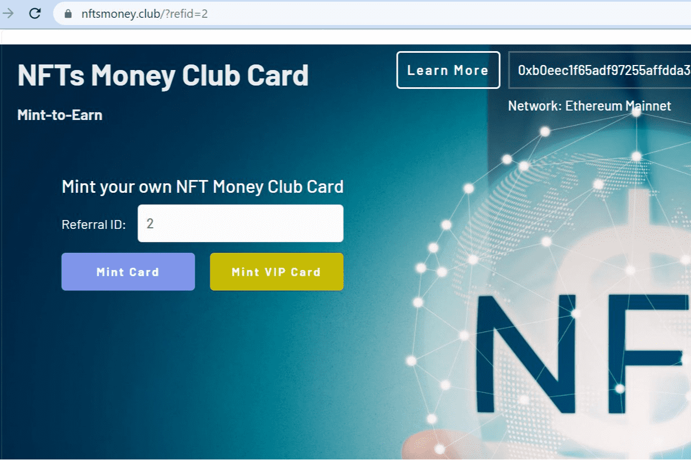

# NFTs Money Club

在 NFT 上赚钱的过程非常依赖运气。

NFTs Money Club 将改变在 NFT 上赚钱的过程，使其更加稳定和可预测，同时也为你的运气留出足够的空间。在许多其他系列之上，NFTs Money Club 持卡人将在市场上拥有巨大优势。 

NFTs Money Club Card 是有史以来第一张旨在从社区增长、第三方收藏推广和 NFT 兑换佣金中赚取收益的 NFT 卡。

像 Facebook 这样的 Web2 网络创造了难以想象的人类财富。尽管用户是最关键的成分，但其​​中几乎为零。但在 Web3 中，大量价值是通过网络外部性创造的，许多从外部看起来像庞氏骗局的东西可以为每个参与者带来巨大的正数财富。 

每个人都可以变得富有，因为大社区本身创造了额外的价值。我们坚信，帮助社区在早期阶段和进一步发展的人应该得到公平的回报。

使用复杂的 NFT 创建社区并在其中分配价值是 NFT Money Club 今天提供的未来技术的优势。

简而言之，我们的计划：

• 建立社区；

• 开始从第三方的收藏推广和整合中获得收入； 

• 进行NFTs空投、NMCT代币空投；

• 启动社区拥有的 NFT 交易所；

• 创建 NFT 货币 DAO——一种基于 NFT 的 DAO；

铸造卡片 ⇨ 分享信息 ⇨ 获得公平的 ETH 奖励。

铸币赚钱！ 

