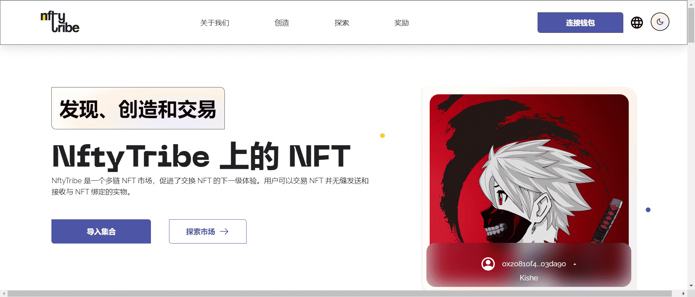

# NftyTribe

NftyTribe 是一个多链 NFT 市场，促进了 NFT 交换的下一级体验。为了充分发挥这种潜力，我们决心将实用性放在首位！ 

这些是 NftyTribe 的一些主要功能 -

NFT 质押：

NftyTribe 为创作者提供必要的工具来激励他们跨多个网络的社区。 

NFT Staking 为收藏家创造了一种在保留其 NFT 所有权的同时获得奖励的新方式；从而为他们的 NFT 创造额外的效用！ 

懒人铸币：

没有gas费，没问题！NftyTribe 有意降低 NFT 新创建者以零成本铸造 NFT 的准入门槛。

首次出售给买家时，铸币费将转入 NFT 的购买价格。当您可以稍后付款时，为什么现在担心 

交易奖励： 

在 NftyTribe 上的每项活动都可以获得多项奖励！我们热爱我们的社区，我们希望确保在 NftyTribe 上创建和交易 NFT 时，我们会定期奖励所有忠实用户。

实物：

NftyTribe 最令人印象深刻的功能之一可能是创作者能够对现实世界的资产进行数字表示并将其作为 NFT 在 NftyTribe 上出售。实物资产的所有权在购买数字副本时转移给买方，一旦卖方接受发货请求并完成销售，资产就会被平等地发货。 

互操作性：

从其他市场轻松导入您的 NFT 收藏，并享受与在 NftyTribe 上铸造的 NFT 相同的贸易利益。用户还可以在 NftyTribe 上铸造他们的 NFT 并在其他市场上进行交易。

