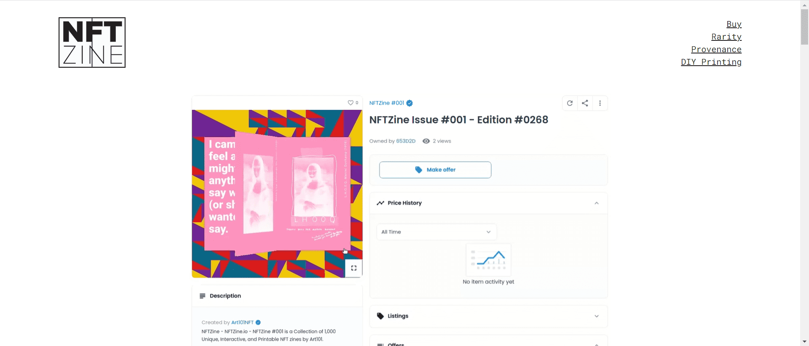

# NFTZine

NFTZine #001 是 Art101的第一个1,000 个独特、交互式和可打印的 ETH NFT 杂志的集合。

Art101 的 NFTZine 是一个交互式和可打印的 NFT Zine。NFTZines 是可生成的，每个 NFT 都是独一无二的，具有自己的个性和稀有性。每个 NFT 杂志的可打印 PDF 副本附加到每个令牌元数据。NFTZine 是对 DIY 艺术界的关键人物 zine 的加密致敬。

由Cartyisme创建，由Raffy发起，由lza_menace发起，并由jwinterm NFTZine 支持，是对 DIY 艺术界的关键人物 zine 的加密致敬。

