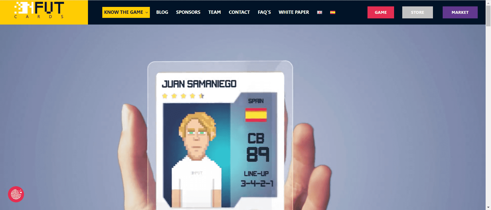

# NFUT Cards

NFUT Cards 是一款 PVP 足球游戏，围绕足球经理元界创建，以区块链技术和 NFT 集合作为游戏资产，玩家可以通过游戏进行游戏并赚取代币，并通过代币 $NFUT 为 NFUT 生态系统做出贡献。

所有游戏资产都将存储在币安智能链上，分别为 BEP-20、BEP-721。

该项目和游戏将完全由社区通过本文档后面解释的治理来运行。这个项目是由人民创造的，我们将引导 NFUT 宇宙始终牢记我们的座右铭：您选择，我们创造。

我们的目标是与这个世界的不公正作斗争，通过革命性的视频游戏创建一个长期项目，让全球任何人都可以首先玩得开心，其次赚钱，这在几年前是不可想象的。

通过玩 NFUT，您不仅仅是在玩电子游戏，您还在为自由、独立和去中心化的权力而战，我们都是一体的。

与此游戏中的其他项目相比，玩家技能的重要性将是关键，您产生的金额将与您的能力成正比。

NFUT 希望与其他人有所不同，创建一个由玩家自己领导的社区，他们将在完全民主化的环境中拥有治理和决策权，最终拥有 NFUT 生态系统。

就好像它是一个社交网络一样，我们将提供不同的工具来塑造平台的发展，例如用户聊天、搜索、直播和在线锦标赛。

NFUT 游戏可以在任何设备上玩，它将完全使用 HTML 5、Javascript 和其他技术构建，并且可以在任何网络浏览器上访问。必须有互联网连接才能玩。

