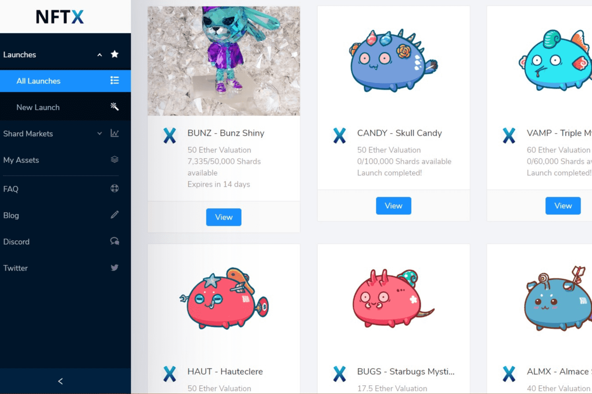

# NIFTEX

NIFTEX 促进了不可替代代币 (NFT) 的部分所有权。NIFTEX 平台支持将 NFT 划分（“启动”）为符合 ERC20 标准的可替代部分。我们将这些可替代的部分称为“碎片”。碎片可以像 NIFTEX 交易所上的任何其他 ERC20 一样进行交易。碎片化有许多优势：它有助于为 NFT 所有者释放流动性，使有价值的 NFT 的获取民主化和廉价化，并大大改善 NFT 市场范围。

