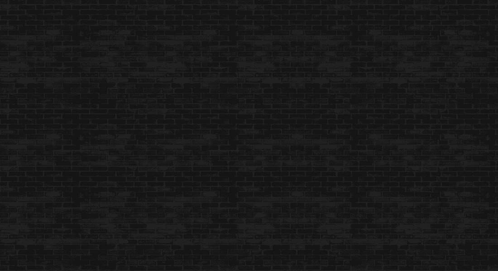

# Nifty Royale X Jonathan Winbush Sewer Shark

搜集艺术家原创作品的限量版将作为基础 NFT 铸造，并在每个 Drop 的初始销售期间以固定价格出售。

购买的 NFT 将进入大逃杀进行相应的掉落。 NFT会被一个一个随机淘汰，直到只剩下一个NFT。

无论 NFT 在大逃杀中的状态如何，收藏家都可以随时从 Battles 页面自由地在二级市场上买卖 NFT。

在战斗结束时，最后剩下的 NFT 将成为获胜者，并升级为同一艺术家的 NFT 版本之一。

