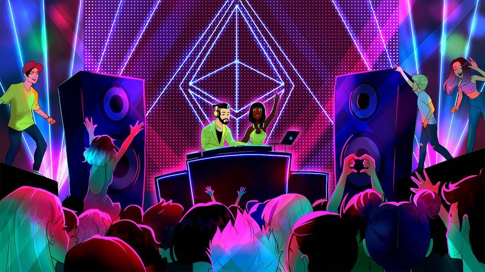

# Nifty DJs Official

他们野蛮、有竞争力，他们将争夺官方 Top100 Metaverse DJ 的第一名，通过 Electro Dance Music 的声音为 NFT 空间注入活力。在以太坊区块链上发现了 20 个神秘的控制台。 他们似乎播放了 20 首不同的 EDM 原创曲目，并且 10.000 个以编程方式生成的 DJ NFT 即将开启它们。一场比赛将进行，只有最优秀的 Nifty DJ 才能登上官方 100 大元界 DJ 的第一名，成为 NFT 音乐界的传奇！每个 DJ 都是以太坊区块链上的 ERC-721 不可替代令牌，具有 IPFS 分散存储的元数据。 铸币成本将固定为 0.05 ETH，每笔交易最多 50 个 Nifty DJ。 该过程可以避免元数据泄漏，因此无法提前猜测特征。

