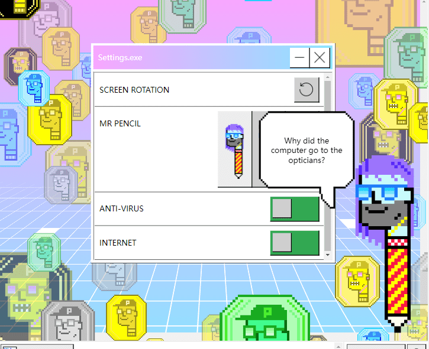

# 

1980 年代初，在一个平行宇宙中，一个由非凡的计算机科学家、艺术家和梦想家组成的团队着手构建一个与众不同的操作系统。 基于没有两个实例应该相同的想法，NiftyDOS 诞生了。从告诉您当前大致天气的天气应用程序和试图预测未来的新闻应用程序，到让您想知道“等等这实际上不是错误吗？”的奇妙功能，NiftyDOS 给你一个怀旧和 异想天开地一瞥 1980 年代计算机技术的神奇世界。每个 NFT 都由 NiftyDOS 操作系统的一部分直观地表示。 这将出现在显示 NFT 的 OpenSea、Metamask 和其他与以太坊兼容的 Web3 Dapp 上。

