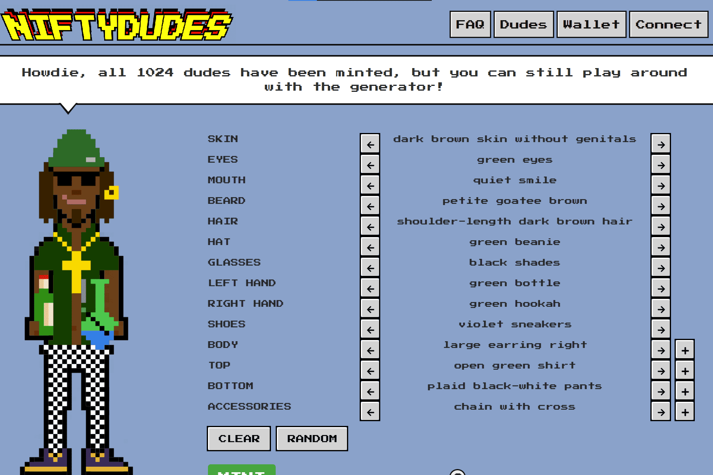

# Niftydudes

大多数加密收藏品的工作方式完全相同。有人选择一个主题，然后随机自动生成或手动创建一堆 NFT，同时使用一些罕见的和一些常见的特征，仅此而已。另一方面，Niftydudes 通过让用户自由选择特征组合，让用户参与到创建过程中。Niftydudes 不提供预先生成的令牌集，而是允许根据一组特征创建自己的角色。您想要一个具有特定发型和服装的 Niftydude 吗？只需选择您喜欢的组合并铸造他。你甚至可以有不同的层。你想让你的兄弟在裤子外面穿内衣吗？没问题。好吧，您可能会问，如果任何人都可以铸造他们喜欢的组合，那么如何确保特征稀缺性。每次创建花花公子时，都会从可用特征列表中删除一个特征。出色地，并非每次都如此，因为可能会选择删除之前已经删除的特征。在这种情况下，不会删除任何特征。这样，随着每一个新的 Niftydude 被铸造出来，特征的移除速度就会减慢。使用这种方法，不可能知道哪些可用特征是常见的，哪些是罕见的。有些特质会被普遍使用，有些特质会非常稀有，有些可能根本不会使用。

