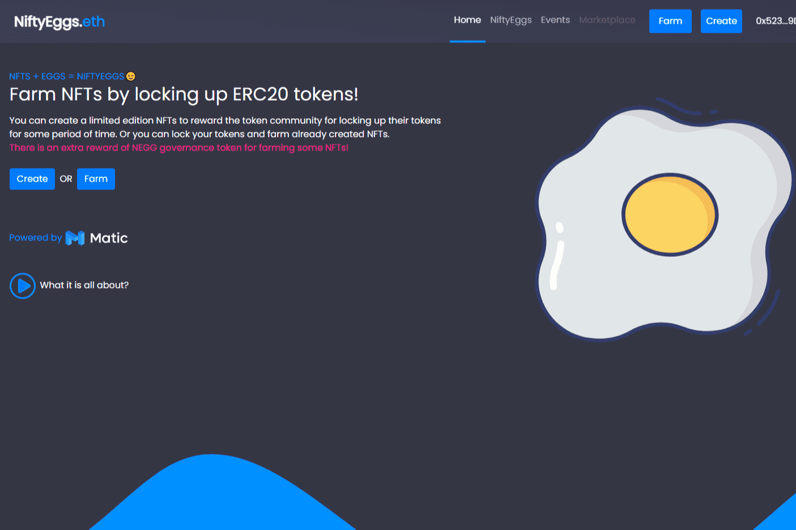

# NiftyEggs

通过锁定 ERC20 代币来种植 NFT！
您可以创建限量版 NFT 来奖励代币社区锁定他们的代币一段时间。或者你可以锁定你的代币并农场已经创建的 NFT。

种植一些 NFT 可以获得额外的 NEGG 治理代币奖励！

该项目旨在奖励用户在一定时间内锁定其 ERC20 代币，并获得有限数量的不可替代代币（NFT）。这样，代币创建者和代币所有者都可以从这种模式中受益。Dapp 在 Matic 上运行，可进行快速且廉价的交易。

