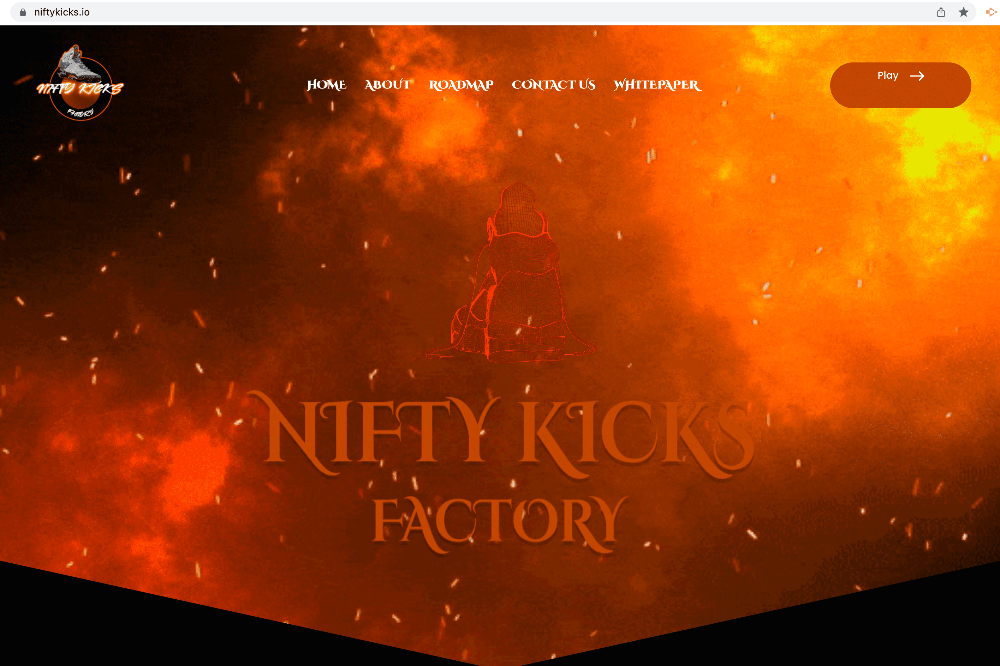

# NiftyKicks Factory

Nifty Kicks 是首个在 Wax 区块链上建立工厂的 P2E 游戏。它从一开始就考虑到了社区，它有一个强大的代币经济学模型，我们认为它会在很长一段时间内充满乐趣和回报。最初以运动鞋为中心，您建立的工厂和设备将生产原材料，使您能够发展工厂、生产运动鞋或出售这些材料或 NFT 用于蜡。但这还不是全部，我们对增长有很好的愿景。Metaverse Nifty Kicks 处于一个充满竞争的危险地方。谁知道潜伏并威胁您工厂存在的危险，以及您的运动鞋运输的安全。 

我们与多个新兴和成熟的项目合作，为您的 NFT 和代币创建一个跨游戏和交叉利用的元界生态系统。这归结为跨多个项目的 NFT 更实用。但这不仅仅是关于 NFT 本身，这些合作将涵盖从 niftykicks 和另一个项目之间的游戏机制的集成到 niftykicks 成为元素/资产的主要供应商。这将我们带到了最后一点，虽然我们热爱运动鞋和运动鞋文化，但你漂亮的 kicks 首席执行官已经在努力建立一个让我们超越运动鞋的企业集团，并从本质上为虚拟世界创建一个真正的工厂。

