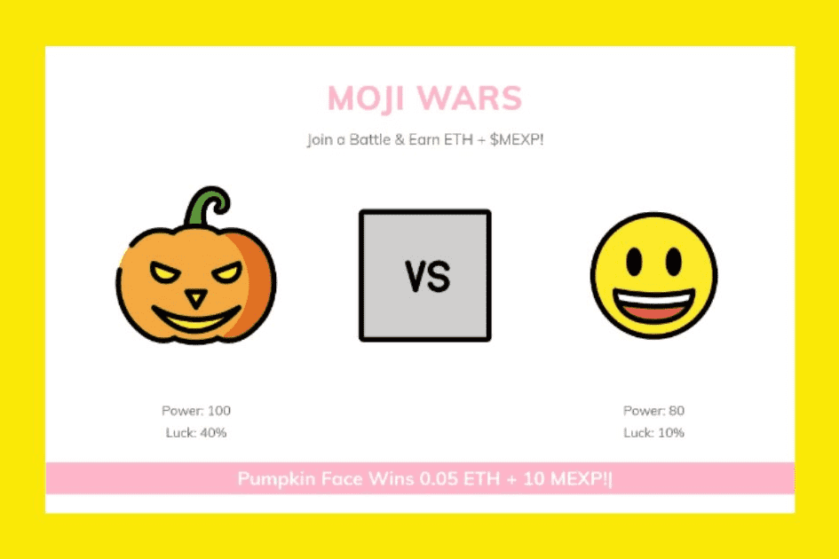

# NIFTYMOJI

将 3,186 个 EMOJI 视为不可替代的代币。NFT 遇上 DeFi！☑ 有限的 NIFTYMOJIS：区块链上只会发布 3,186 个 Niftymojis（基于 OpenMoji 12.0）！☑ 唯一性保证：每个 Niftymoji 都刻有独特的表情符号和在链上动态生成的力量+运气分数。☑ 公平分发：Niftymojis 在用户购买和铸造新 MOJI 时随机分发。幸运的用户将能够铸造具有高能量和幸运分数的流行表情符号！☑ 感觉幸运？如果你感觉幸运，你可以随时重新生成你的 MOJI 的链上力量和运气分数。掷骰子来升级你的 MOJI！☑ 每日挖矿奖励：拥有MOJI，您可以每天挖掘/赚取MOJI 经验值（$MEXP）代币！拥有 MOJI，您每天最多可以挖掘 10 个 MEXP。☑ PLAY TO EARN：MOJI Wars 将于第二季度推出，2020 年，允许用户使用他们的 MOJI 相互对战，以赚取以太币 (ETH) 和 MOJI 经验积分 (MEXP)。☑ SCARCE MEXP：$MEXP 将用作加入战斗和升级你的 MOJI 的费用。这样的费用会自动销毁！☑ NFT MEETS DEFI：通过 UniSwap 流动性池将您赚取的 $MEXP 无缝换成 ETH，保证您的体验总是物有所值！ 

