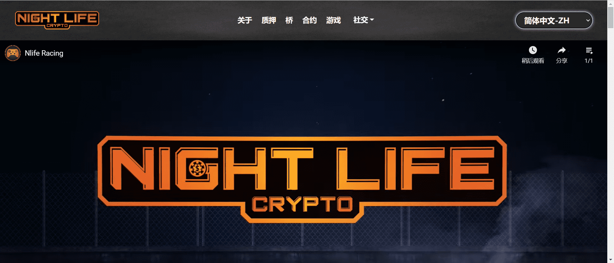

# Night Life Crypto

Night Life Crypto 是一个游戏平台，它将区块链游戏的质量提升到应有的水平。该平台正在制作高质量的平台和街机游戏，这些游戏将复制 Steam 和加密之外其他平台上游戏的风格和质量。

利用 2 层解决方案（币安智能链和海龟网络），它带来了加密领域前所未有的功能。NLIFE 代币可以在 pancakeswap 上购买，然后可以发送到用户的 NLIFE 账户的钱包（钱包是非托管的，所以用户可以完全控制他们的资金），可以用来购买/玩游戏，交易成就 NFT在即将到来的市场等等。平台上制作的每款游戏都向用户收取0交易费。所有游戏音乐均由专业音乐家制作。

用户还可以质押 NLIFE/BNB 流动性，这使他们能够根据所质押的金额与所质押的总金额获得一部分 1.5% 的代币转让费。这允许用户获得收入流，而不会产生额外的销售压力，因为奖励来自代币转移费用，而不是额外代币的铸造。

菲亚特开/关坡道将在未来几个月推出，以及其他街机/平台游戏、购买/出售游戏皮肤的市场、成就 NFT 和即将推出的甲板构建交易卡游戏中的 NFT 卡。随着时间的推移，将举行锦标赛，顶级用户将能够赢得 NLIFE 以及其他奖品。

