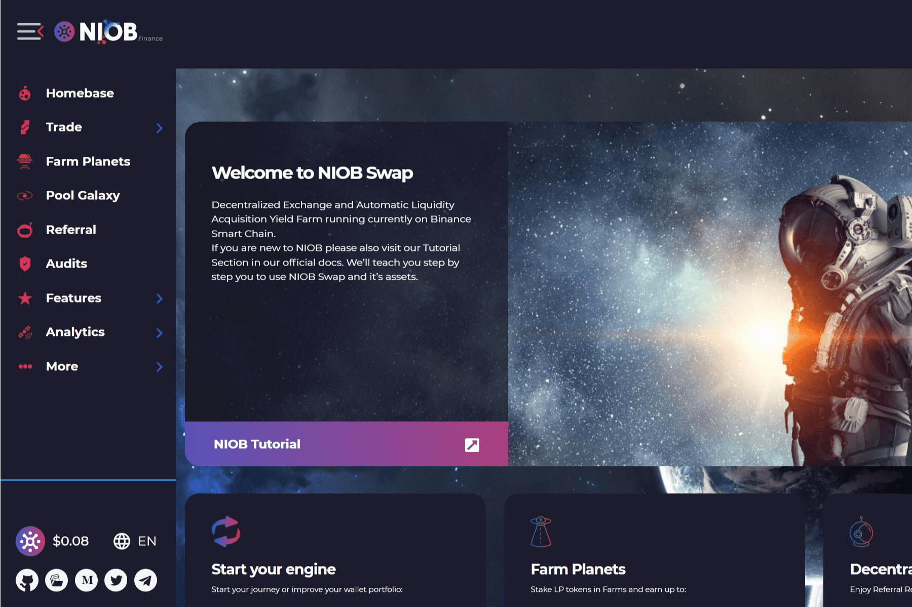

# NiobFinance

Niob Finance 是一个去中心化交易所和自动流动性获取收益农场，具有三级推荐系统。Niob 目前在 BSC 上运行，并计划在未来在其他几个区块链上启动。该项目使用通货紧缩令牌 NIOB。每次转移令牌时，都会触发自动销毁机制。NIOB 代币的另一个独特功能是能够将部分转让税分配给锁定的流动性。Niob 团队将根据 Niob 的路线图提供的创新产品和功能应该为用户提供一个可持续的环境，让他们受益于高 APR 农业和许多其他 DeFi 解决方案，例如预测交易、NFT 平台和非托管加密钱包法定逃亡。

