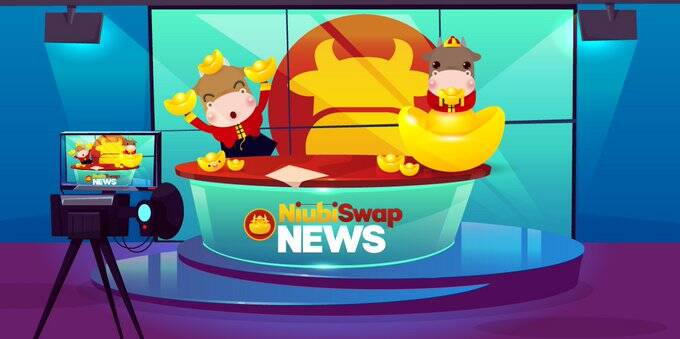

# Niubiswap

Niubiswap 通过提供有利可图的功能和公平的管理机构，使其用户能够通过我们的#NIU 代币获得被动收入。用户为我们的资金池提供流动性，这将导致我们的代币获得奖励。奖励取决于用户在矿池中的股份数量。我们希望不仅仅是一个收益农场，我们将拥有游戏化功能、彩票和大奖，以增加我们的代币 NIU 的效用。

Niubiswap 使用区块链技术为其用户提供传统金融机构不允许的财务自由。我们希望我们的用户能够控制自己的资金，因为他们认为我们的平台完全去中心化、无需许可和无需信任。用户完全可以控制他们的代币、资金，最重要的是他们的身份。  

开放的决策和集体智慧是我们在充满活力和竞争激烈的市场中取得成功的秘诀。我们需要快速适应竞争，并能够充分利用集体智慧和任何开放的贡献，充分包容并以所有可能的投入激励人才的参与。

Niubiswap 专注于通过去中心化和社区驱动的策略通过设计解决这些问题。拥有一个名为 NIU 的原生治理代币，完全社区分布，NIU 持有者将在 DAO Gov 平台上以开放的决策策略做出决策，以确保创始人、股东和 NIU 持有者在 Niubiswap 的同一方向上具有凝聚力.  

