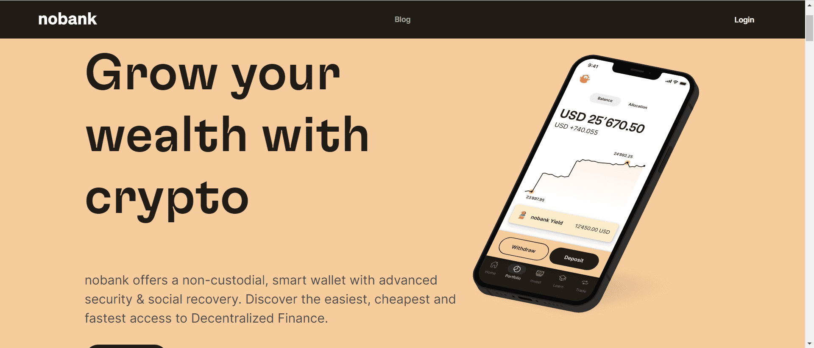

# nobank wallet

在nobank，我们相信只有像传统应用程序一样简单的钱包才能被很多人采用！钱包是 web 3 的入口和交互点，是用户的数字身份——所有个人信息都应该存储在钱包中，去中心化，并以区块链为重点。作为 nobank，我们希望推动这种采用并构建能够实现这一目标的产品。

什么是无银行？

nobank 提供具有高级安全性和社会恢复功能的非托管智能钱包。我们利用Harmony 区块链提供最简单、最便宜和最快速的 Defi 访问。nobank 提供了一个真正简单直观的产品，每个人都可以使用（甚至是你的妈妈和爸爸），而不会影响区块链技术的基础，从而使 defi 更易于访问。 

我们的特点是什么？

具有 Google Auth 恢复功能的智能钱包 - 多设备以及通过 ramp.network 在移动应用程序和网络应用程序上使用FIAT 桥接器 - 我们不收取额外费用！

整合 DeFi Kingdoms、Sushiswap、Defira、Elk 和 Viper Swap，以最优惠的价格执行交易

发送和接收支持的令牌

查找有关所有受支持资产的信息和详细信息

交易记录

将应用内质押集成到验证器

提供我们的第一个多元化（非托管）金融产品：大盘指数和GameFi 指数

设置好友以安全交易

为社会恢复设立监护人

和更多

