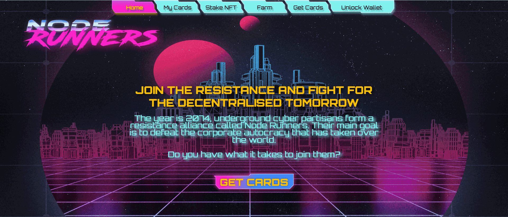

# Node Runners

获取英雄 赌注 英雄 与恶棍战斗并赌注他们！

如果您将 MEME 与 CORE 混合并添加 2074 种口味，您将获得 Node Runners — 一款以赛博朋克为主题的可收藏纸牌游戏。

质押流动性以获得您的英雄 → 质押您的英雄以获得 NDR → 与恶棍战斗以赢得他们的卡片并解放世界！

怎么玩？

首先，你需要准备好你的英雄。在我们的平台上有两种方法：

权益流动性 → 生成哈希 → 将它们换成你最喜欢的英雄 NFT
只需使用您的钱包购买您最喜欢的英雄卡
请注意：卡销售所得资金的 90% 将用于从市场上回购 NDR，并永久锁定流动性。

一旦你准备好你的英雄，你就可以抵押他们开始积累 NDR。Heroes 质押池的大小为 7300 NDR。 

终于到了与恶棍战斗并重新控制堕落世界的时候了！选择你最强大的英雄，用你的支持卡提升他，并攻击你选择的反派！

击败恶棍并将他关进监狱！换句话说 - 击败恶棍 → 获得他的牌 → 赌注 → 获得更多 NDR！

