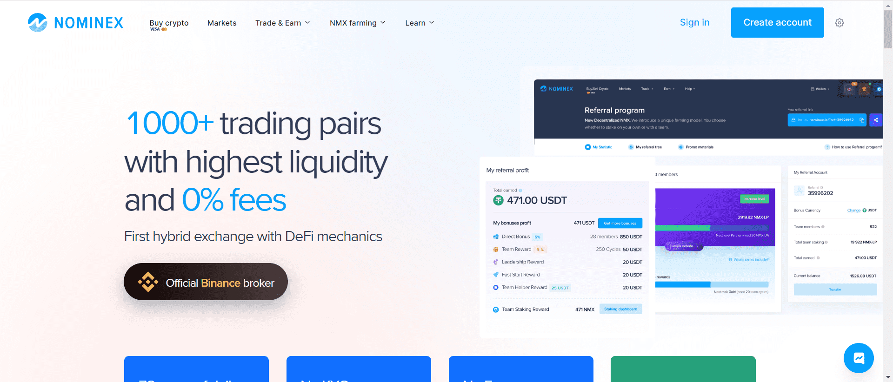

# Nominex / Nomiswap (NMX)

Nomiswap/Nominex 的主要功能

Nomiswap得到了广泛认可的Nominex中心化交易所的支持。这两个平台彼此深度集成。

能够以 0% 的费用进行交易——这要归功于实用的耕作/质押，您可以在其中收到与您放入流动性池或启动池的金额相对应的交易费现金返还。
独特的 Nominex/Nomiswap CeDeFi 生态系统为您提供仅因使用 Nominex 集中式或 Nomiswap 分散式平台而获得奖励和利益的机会。
实用的耕作和质押- 意味着您可以获得额外的推荐奖励、推荐计划资格和特殊规模的交易费用现金返还，用于保留在耕作池和启动池中的价值量。
来自 3 种活动的推荐奖励——您从支付的交换费、农场代币和通过启动池获得的代币中获得奖励。
具有 2 种奖励的二元推荐计划- 您从自己的直接推荐人（通过您的推荐链接开始使用该平台）的所有活动中获得奖励。而且，您还可以从您的推荐结构中您下方的任何级别的所有人员那里获得整个推荐团队的所有活动的奖励 - 这称为无限推荐级别。

