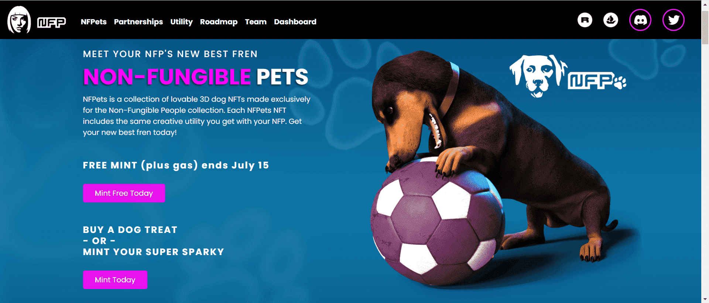

# Non-Fungible People

Daz 3D 的首个 NFT 合集 Non-Fungible People (NFP) 是 8,888 个超现实 PFP 的合集是由数千个独特特征生成的 8,888 个超现实 PFP 的集合，并以惊人的 3D 呈现。

Daz 3D是 NFT 战略、营销和全栈开发（包括生成式 PFP 集合）的领导者。该公司与华纳兄弟、Champion、可口可乐、三星、Louis Moinet 等标志性品牌合作，为虚拟世界打造跨链 NFT 系列和可穿戴设备。2021 年，它与 RTFKT（现为 Nike）合作，为 CloneX 带来 3D 实用程序，Daz 有几个 PFP 项目计划在 2022 年进行。

