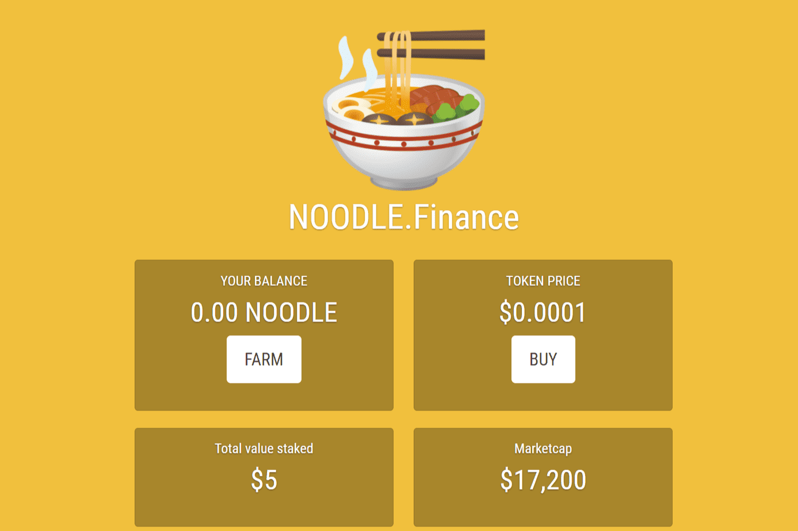

# NOODLE.Finance

为什么是面条？

$NOODLE 将成为最成功的 DeFi 农业代币！做你自己的面条🍜

面条比寿司和泡菜好得多。- 在接下来的三个月里，每 172800 个区块（大约 30 天）奖励将减半。第 1 个每块 1000 个代币 第 2 个每块 500 个代币 第 3 个每块 250 个代币 每块第 4 个 125 个代币 - 保护 NOODLE 持有者，原生代币池的奖励将大大降低 NOODLE 将是最成功的 DeFi 农业代币！仅NODLE/ETH 4X

