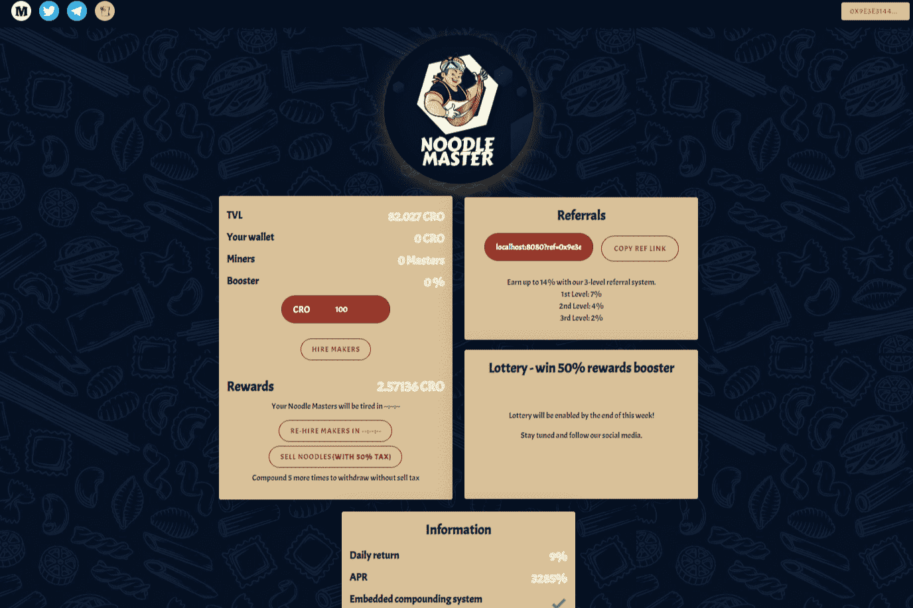

# Noodle Master

什么是面条大师？

Noodle Master 是一个在 Cronos 网络上实施的项目。由于采用了先进的解决方案，您不可逆转的受阻投资的每日回报将达到每天 9% 的水平。

该团队创建了自己的智能合约和友好的 Dapp。多亏了这一点，在创建我们时，我们没有分叉流行的项目，而是我们自己的创新矿物。我们添加了许多显着影响矿物寿命的功能。

我们结合了许多有趣的新功能，使我们成为同类协议中的第一个，专注于安全和长寿。我们的投资者通过投票直接决定项目的命运，投票权与矿工成正比

1）3级参考系统高达23%！

2) 彩票

3) 加密货币价格预测

4) 道

5) NFT 集合（未来）

我们的买卖税。

3% 营销钱包（激进营销）

2% 开发

1% 合伙人

