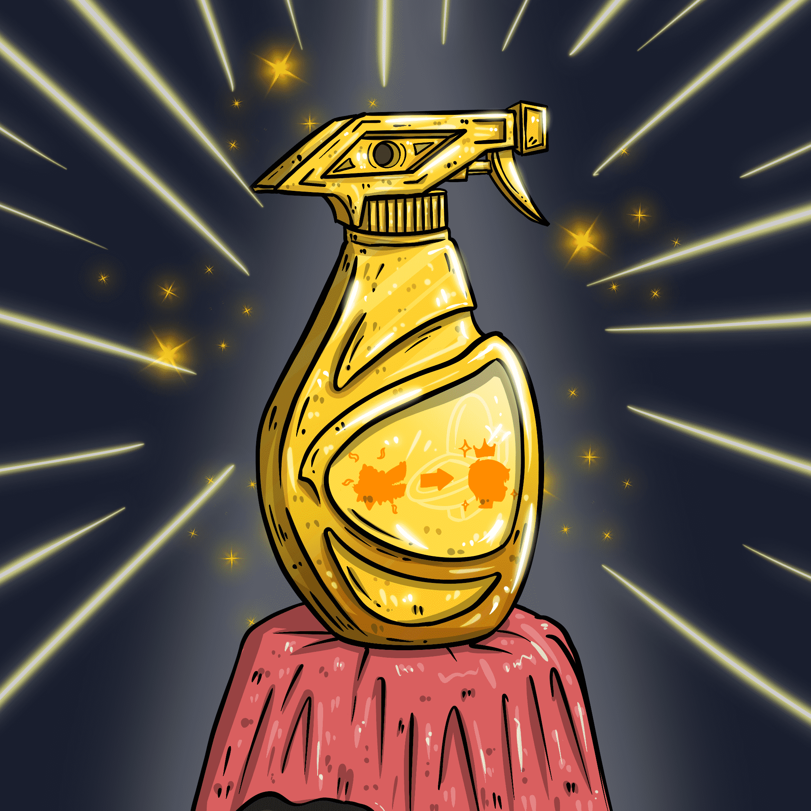

# NoShitZone

你们这些傻逼在看什么？这不是狗屎区！
▶ 什么是 NoShitZone？
NoShitZone 是一个 NFT（不可替代令牌）集合。存储在区块链上的数字艺术品集合。
▶ 有多少 NoShitZone 代币？
总共有 3 个 NoShitZone NFT。目前，385 位所有者的钱包中至少有一个 NoShitZone NTF。
▶ NoShitZone 最昂贵的促销活动是什么？
出售的最昂贵的 NoShitZone NFT 是 WTF 是传说中的清洁剂。它于 2022 年 6 月 14 日（3 个月前）以 7.84 万美元的价格售出。
▶ NoShitZone 最近卖出了多少？
过去 30 天内售出了 1,361 个 NoShitZone NFT。
▶ NoShitZone 的费用是多少？
过去 30 天，NoShitZone NFT 最便宜的销售额低于 372 美元，最高销售额超过 1328 美元。过去 30 天，NoShitZone NFT 的中位价格为 620 美元。
▶ 什么是流行的 NoShitZone 替代品？
许多拥有 NoShitZone NFT 的用户还拥有 Pixelverse Poops、 ShitBeast、 ShitPlunger和 De-Generations: S。

