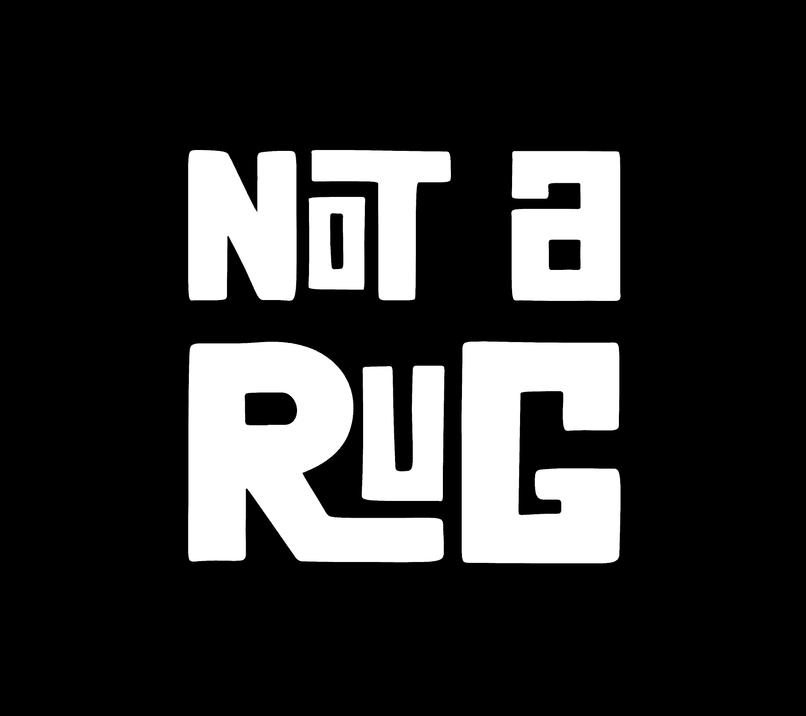

# NOT A RUG

以太坊区块链。8000 总供应量。每个钱包最多 5 个。免费+天然气。没有承诺。

不要成为一个他妈的纸手 MF。

不是 RUG NFT - 常见问题（FAQ）
▶ 什么是非地毯？
NOT A RUG 是 NFT（不可替代代币）集合。存储在区块链上的数字艺术品集合。
▶ 存在多少 NOT A RUG 代币？
总共有 8,000 个 NOT A RUG NFT。目前，1,377 位车主的钱包中至少有一个 NOT A RUG NTF。
▶ 最近卖出了多少 NOT A RUG？
过去 30 天内售出 0 个 NOT A RUG NFT。
▶ 什么是流行的 NOT A RUG 替代品？
许多拥有 NOT A RUG NFT 的用户还拥有 Goblin Mfers， The Human Mind | 作者：Rafael、 16 Bit Apes和 Basquimfers。

