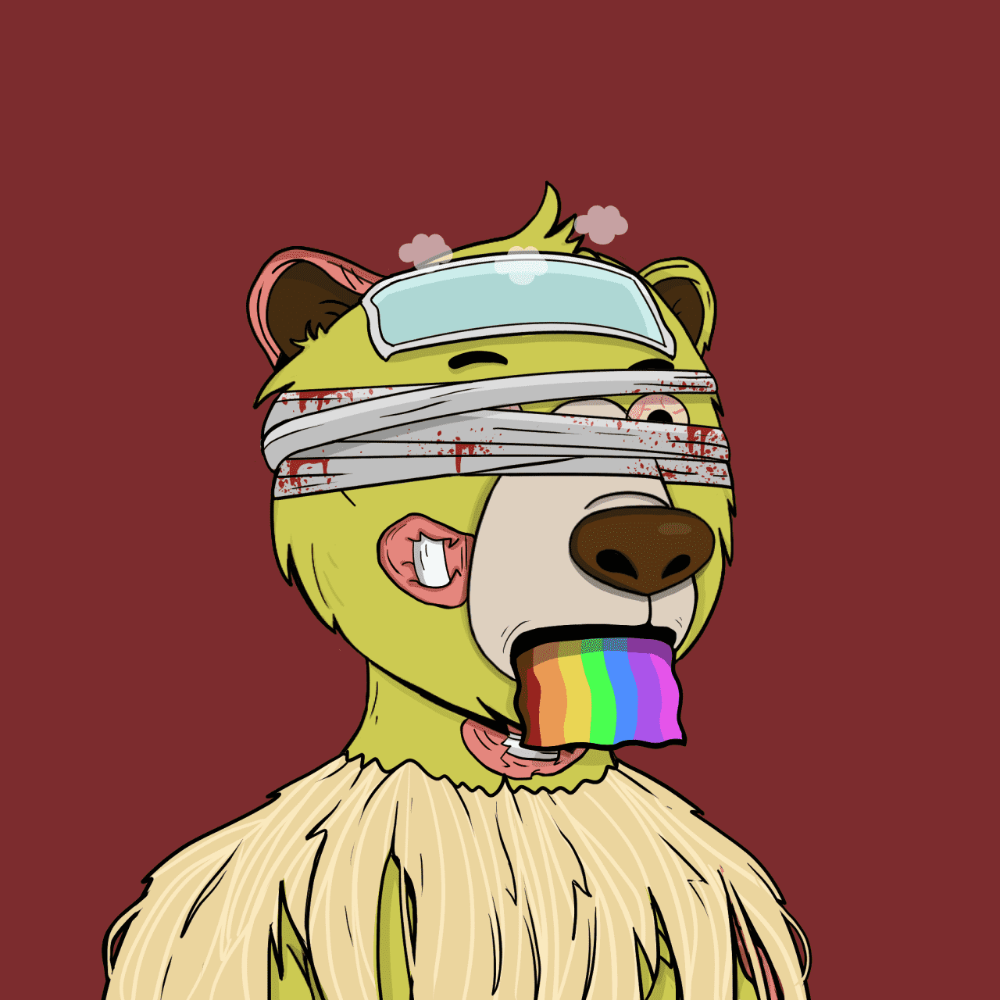

# Bears Not Okay

Bears Not Okay NFT - 常见问题（FAQ）
▶ 什么是熊不行？
Bears Not Okay 是一个 NFT（不可替代代币）集合。存储在区块链上的数字艺术品集合。
▶ 存在多少 Bears Not Okay 代币？
总共有 4,000 个 Bears Not Okay NFT。目前，685 位所有者的钱包中至少有一个 Bears Not Okay NTF。
▶ 最昂贵的 Bears Not Okay 促销是什么？
售出的最昂贵的 Bears Not Okay NFT 是 Bears Not Okay #2741。它于 2022-06-06（3 个月前）以 90.7 美元的价格售出。
▶ 最近卖出了多少 Bears Not Okay？
过去 30 天内售出了 48 个 Bears Not Okay NFT。
▶ Bears Not Okay 多少钱？
在过去 30 天里，最便宜的 Bears Not Okay NFT 销售额低于 2 美元，最高销售额超过 7 美元。Bears Not Okay NFT 的中位价格在过去 30 天内为 2 美元。
▶ 什么是流行的 Bears Not Okay 替代品？
许多拥有 Bears Not Okay NFT 的用户还拥有 Alchemist Order Genesis、 Okay Mama Moon Azuki Bears Yacht Club、 NotDeGods和 Web3 Wizards Alpha Pass。

