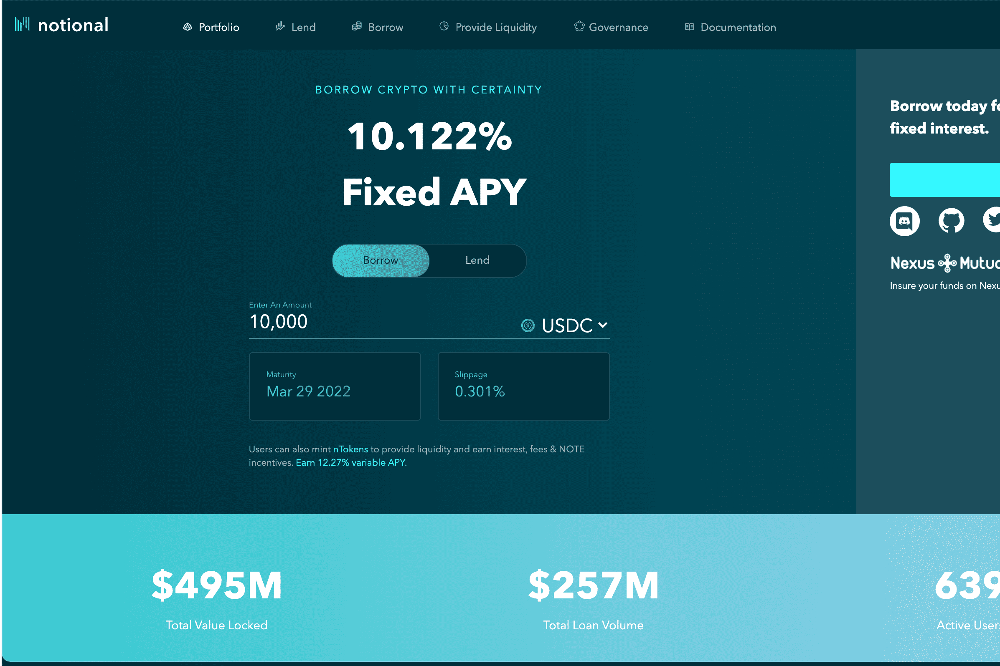

# Notional Finance

Notional 是第一个基于以太坊的去中心化协议，用于以固定利率和固定条款进行借贷。通过浮动利率借贷，DeFi 只能服务于加密借贷市场的一小部分，因为浮动利率不能提供贷方和借方所需的确定性。Notional 通过为贷款人和借款人创造一个真正的市场来解决这个问题，使个人投资者、企业主和机构投资者民主化并赋予他们权力。

目前，用户可以从 Notional 的链上流动性池中借入或借出最长一年的 USDC 和 DAI，以及最长六个月的 ETH 和 WBTC。通过 Notional 的 V2 升级，流动性提供者享受低接触体验，并且不再需要将其债务滚动到新的到期日，因为它是通过使用代表用户在流动性池中份额的 ERC20 代币 nTokens 自动完成的。

在 2021 年 5 月从包括 Coinbase Ventures 在内的一些顶级风险投资公司筹集了 1000 万美元的 A 轮融资后，Notional 的协议于 11 月 1 日重新启动，具有许多新功能以及 NOTE 治理令牌和 appx 的 TVL。500M。 

