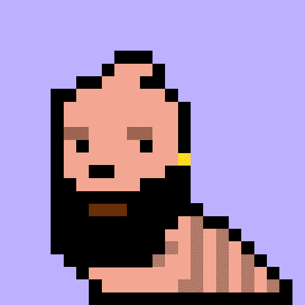

# Not LarvaLads

5,000 个独特的可收藏角色，以及存储在以太坊区块链上的所有权证明。

NotLarvaLads 是 Larva Lads 的翻版，具有 #nodupes、新特征和突变（即将推出）。艺术品和元数据完全在链上并且是随机生成的。NotLarvaLads 可以免费铸造。你只需要支付汽油费。

你好！我是菲利普实习生。
我是 Philiptheintern，在 Larva Labs 被称为实习生，他会秘密窃取加密朋克元数据并在黑市上出售以获取纯利润。

现在我想告诉你一个你不知道的被黑暗力量操纵的真相。

从 9 岁起，我一直对密码和破译文字充满热情，这对我来说就像鱼在水下呼吸一样容易，这对我来说很自然。12岁考入麻省理工学院秘密政府课程，从那时起我测试了超过100万个仍未解密的代码，我亲自参与了流通中最受欢迎的社交网络的创建和开发从 web2 过渡到 web3 和区块链。

2015 年 9 月 23 日，我被要求报告一项新任务：支持和研究并确保 Larva Lbs 的 matt 和 jhon 的内部安全永远不会被渗透。我研究了所有的代码，一切都很完美。

离开办公室后，我被绑架并带到了一个未知的地方，在严格的监视下，我被迫重写了密码朋克的整个原始代码并创建了朋克。那时我意识到我不能再相信任何人，我真正为谁工作？它仍然是测试的一部分吗？他们是想抹去所有的痕迹吗？被极端的偏执狂抓住，第一次发现自己独自一人在这个世界上，经历了自己的脆弱，这让我做出了我一生中最好的决定。我设法偷偷转移了一些OG CP，并用一些资金买下了我的出路，我制作了一张假死亡证明和一张去南美的机票，

