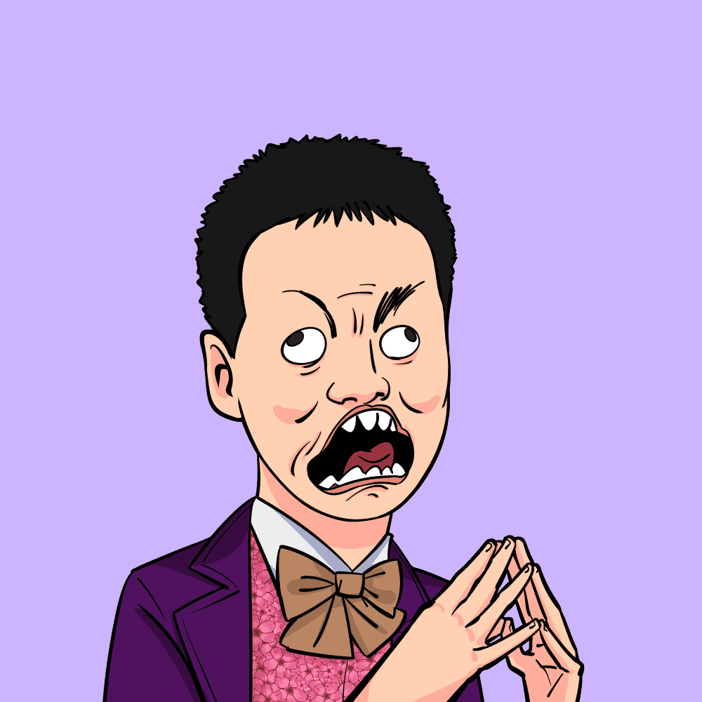

# NotLuna

NotLuna 是一个人 Do Gen 的故事，他冒险穿越他们称之为“三”的新世界。成千上万的人跟随他，因为他们在他身上看到了自己。Do Gen 的许多情绪是我们所有人的许多情绪。Do Gen 可能是……任何人。

我们会成功吗？

▶ 什么是 NotLuna？
NotLuna 是一个 NFT（不可替代令牌）集合。存储在区块链上的数字艺术品集合。
▶ 有多少个 NotLuna 代币？
总共有 10,000 个 NotLuna NFT。目前，5,814 位所有者的钱包中至少有一个 NotLuna NTF。
▶ 最昂贵的 NotLuna 销售是什么？
售出的最昂贵的 NotLuna NFT 是 NotLuna #4200。它于 2022 年 6 月 8 日（3 个月前）以 180 美元的价格售出。
▶ 最近卖了多少个 NotLuna？
过去 30 天内售出了 2,844 个 NotLuna NFT。
▶ NotLuna 需要多少钱？
在过去 30 天里，NotLuna NFT 最便宜的销售额低于 13 美元，最高销售额超过 44 美元。NotLuna NFT 在过去 30 天内的中位价格为 26 美元。
▶ 什么是流行的 NotLuna 替代品？
许多拥有 NotLuna NFT 的用户还拥有 We Are Goki、 Assplosion、臭虫的grimbogs 和 pablos.lol。

