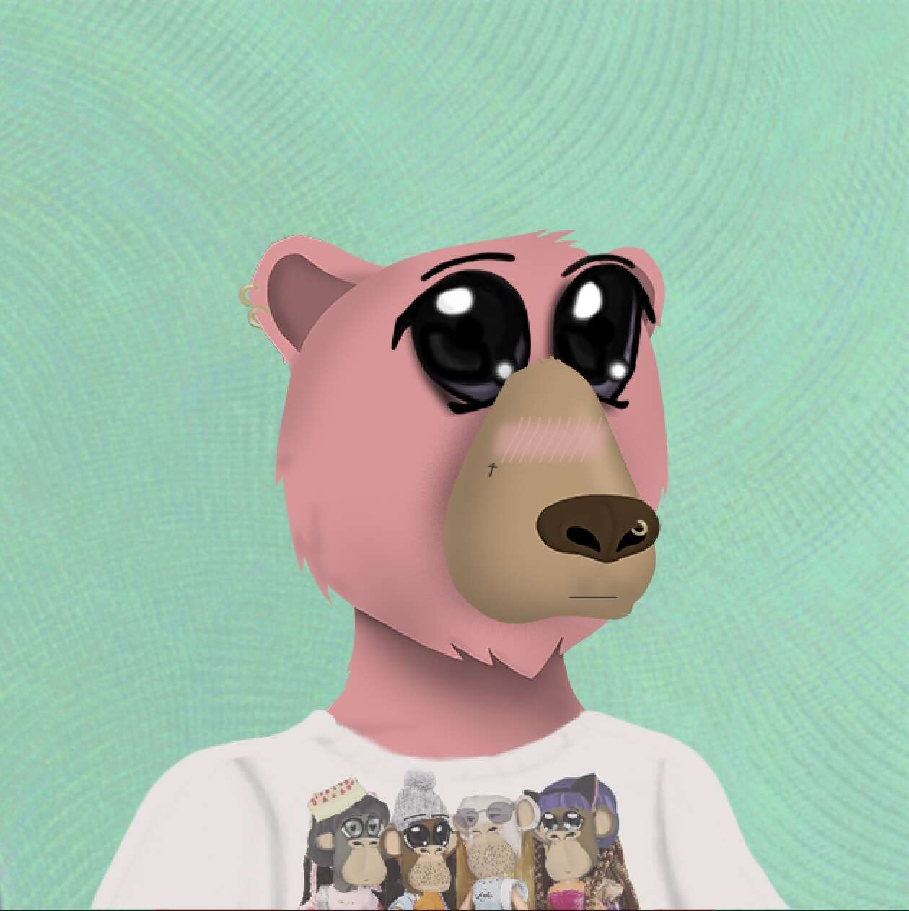

# NotOkayMiladys

Not Okay Miladys 是 3,911 个生成 pfpNFT 的集合，通过用 neochibi 精华对熊进行变异并用网络灵性感染它们而创建。“为什么我的熊会变成这个？！” 熊大声呼喊……答案很简单——“这样更好”。

在元宇宙的黎明，猿人至高无上。每次社交媒体刷新时，都会有一只可恶的猿猴盯着你的灵魂——评判、嘲笑那些没有盲目追随的人。他们的贪婪每时每刻都显而易见，我们看着猿召唤熊，试图扩大他们的帝国并继续抽他们臃肿的袋子。但在混乱中，一场革命开始了，米拉迪斯从阴影中崛起，每天晚上都会通过血誓增加更多的成员。他们的目标？将元宇宙从猿和熊的腐烂中解放出来。

