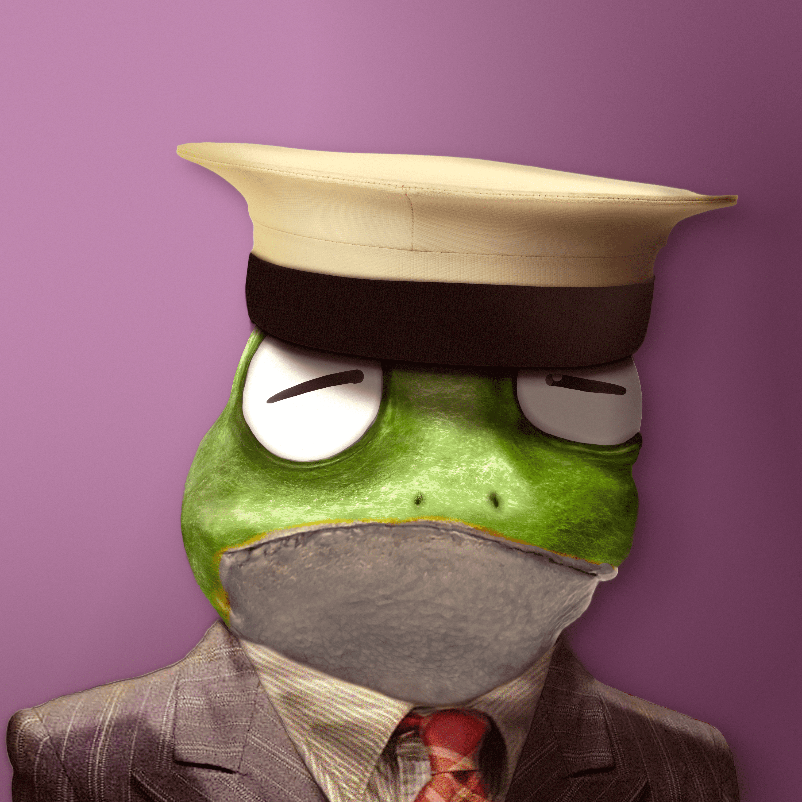

# Notorious Frogs

青蛙是元宇宙的 10,000 名公民。他们住。他们计划。他们陶醉。他们渴望。他们是臭名昭著的。现在他们有LSD。

在此处查看土地合成设备（类似于土地契约）：https ://opensea.io/collection/frogland-computational-toadex

Frogland 是一个风景如画的半岛，是 NewPangea metaverse 的创始区。他们注定要成为所有努力探索的人的家园，他们生活在一个美丽和危险使创造艺术和故事成为可能的世界，满足所有 NFT 项目寻求新生活的愿望。

NewPangea 是一个基于直接来自 Frogland 及其合作伙伴社区的创意、艺术作品、叙事和实用程序的元节。Gutter Cat Gang、0N1 Force 和 Wicked Craniums 率先加入了 NewPangea 的青蛙行列。每个合作伙伴都将在 NewPangea 拥有自己的独立策划区，完全根据他们的审美和传说进行定制，其中充满了直接来自其社区的内容。

