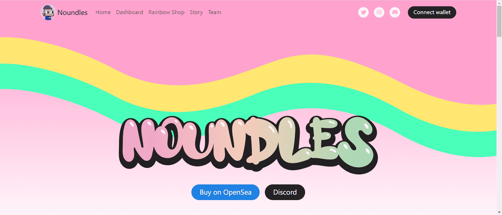

# Noundles

Noundles 是基于通过 Doodles 风格扭曲的名词！

我们的使命是在周边蓝筹社区的帮助下建立一个更具包容性的社区。

所有持有者都将被授予访问 Noundle Grail 的权限...

Noundles 是一个社区主导的 PFP 系列，灵感来自 Nouns，带有平滑的放克风格。我们渴望通过 $RAINBOW 的力量使 NFT 更具协作性、创新性和透明性。

Noundles 是一款在以太坊区块链上玩的 PvE 游戏。每天，Noundles 赚取 4 $RAINBOWS，Companions 赚取 2 $RAINBOWS。Evil Noundles 通过从 Noundles 社区窃取 $RAINBOWS 和新铸造的 NFT 来维持生计。

