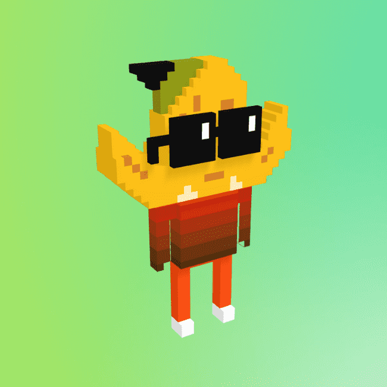

# Nouns3D

Nouns 3D 是 Nouns.wtf 的 3D NFT 社区驱动衍生产品。目标是建立一个去中心化的社区来接管世界！

这是我们迁移的 Nouns 3D Only 0-7399 = Genesis 的新地址，这些地址在 5 年内每天产生 10 $NOUN。

立即开始让您的名词在 3D 中栩栩如生！当您今天采用您的名词时，您可以使用 www.mixamo.com 快速轻松地为 FBX 和 GLB 文件制作动画！让他们跳舞，让他们动起来——可能性是无穷无尽的。

加号 - 您拥有的每个名词每天都会产生 10 美元的名词。在我们的 Nouns3D 生态系统中使用您的 $NOUN 实用代币来命名您的名词、铸造更多名词等等！您可以用 900 美元的 NOUN 兑换一个 VERB：[https ://opensea.io/collection/nouns3d-verbs]

