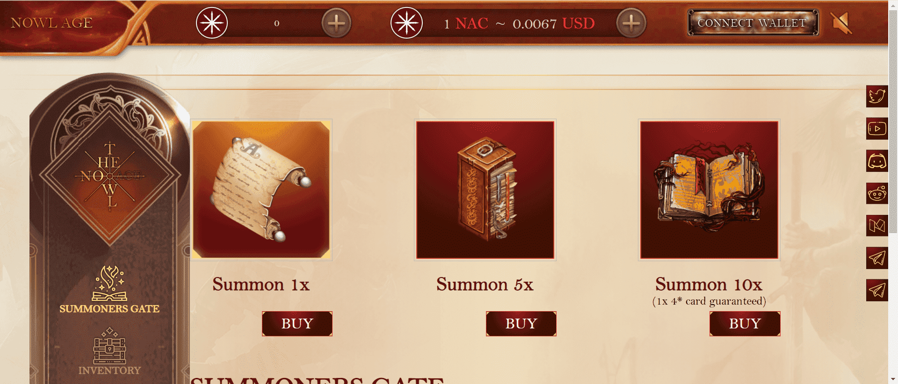

# Nowlage Coin

Nowl Age 是一个 NFT 游戏生态系统，旨在构建一个生活在币安智能链上的广阔幻想世界。全球数百万玩家以简单、快速、有趣的方式参与基于区块链的 NFT 游戏。Nowl Age创建了一个完整的区块链游戏生态系统，将游戏玩家、开发者、社区和分销商连接起来。 

The Nowl Age 利用区块链技术的优势创造了一个以守护者为主角的宇宙。玩家的任务是通过守护者营地和自动战斗系统召唤和训练守护者。 

Nowl Age Game 有两种类型的战斗：PVE（玩家与环境）和 PVP（玩家与玩家），您可以在其中种植物品和 NAC 代币，让您在游戏中前进并发展 The Nowl Age 的经济。 

$NAC 是 The Nowl Age 生态系统的主要实用代币。它简化了支付流程并支持 The Nowl Age 生态系统的发展。 

👉🏻Play to Earn The Nowl Age 利用 Play-to-Earn 模型，通过游戏分配 $NAC，并通过未来功能增加对玩家 NFT 的使用来赋予其价值。NFT 卡可以在市场上自由交易 $NAC 代币，然后可以在交易所出售或转换为法定货币。 

目前，玩家可以获得以下选项： - 通过 Guardian NFT 参与战斗以获得 $NAC。 

- 铸造监护人并在市场上以 $NAC 的价格出售。 

- 与其他玩家交易 NFT 以获得 BEP-20 代币。 

- 在 DEX 上将 $NAC 兑换成可以在 Binance 等交易所交易的货币。 

