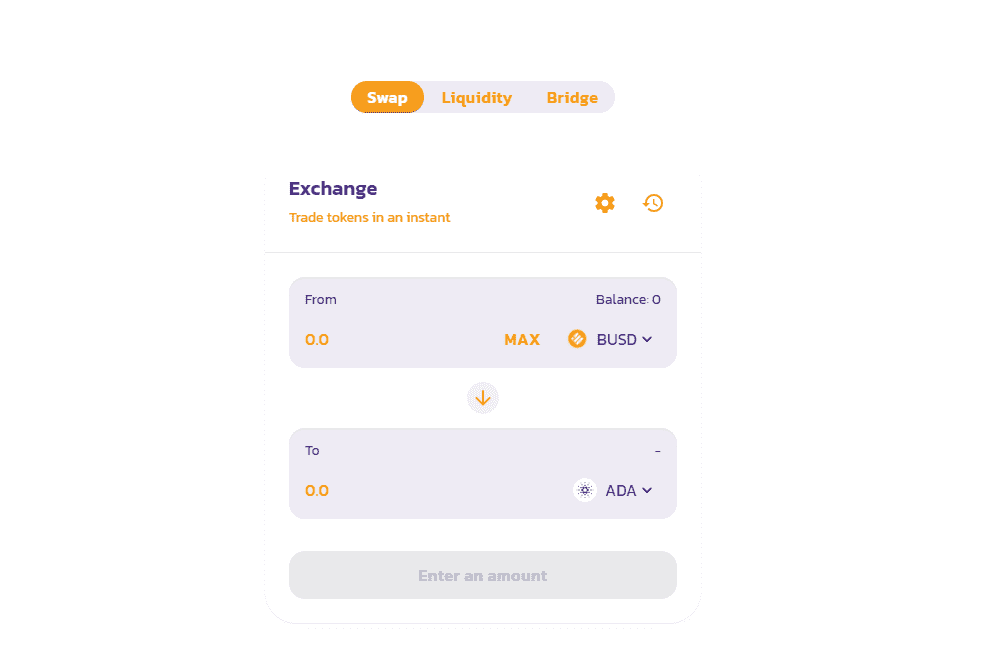

# npct.exchange

npct.exchange 是一个基于币安智能链 (BSC) 的去中心化交易所 - pancakeswap 的一个分支 - 一个自动做市商 (AMM) 和收益聚合器，用户可以在其中提供流动性并赚取费用或质押各种代币并获得非玩家奖励代币（NPCT）。 

npct.exchange（非玩家代币）的主要管理代币最初是一个 meme，但现在与许多 meme 代币不同，它被赋予了目的和未来。

